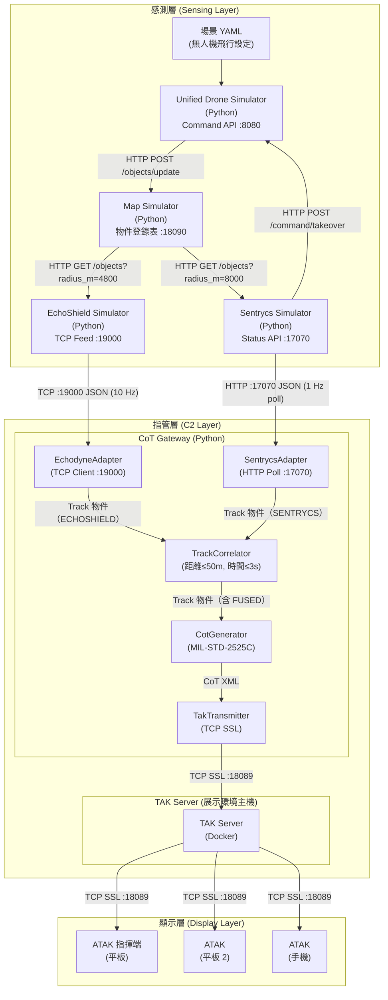
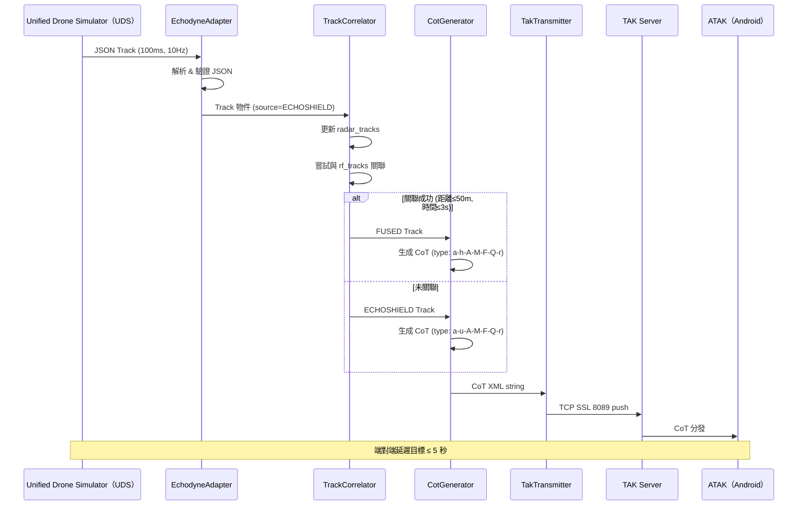
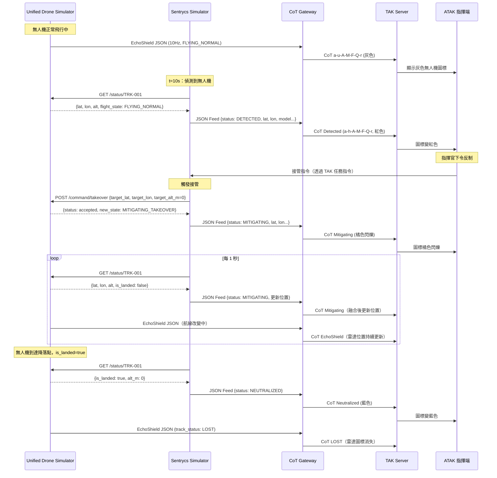
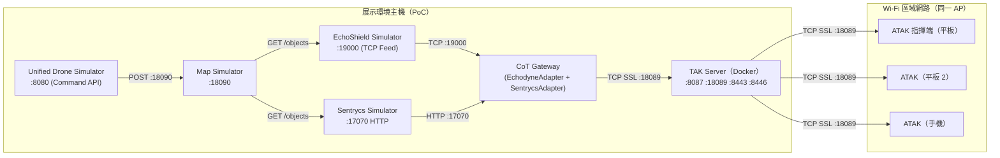

# 系統架構文件

---

| 欄位 | 內容 |
|------|------|
| **文件編號** | 01 |
| **版本** | v0.7 |
| **日期** | 2026-04-23 |
| **作者** | 系統架構小組 |
| **狀態** | 草稿 |
| **機密等級** | PoC 內部使用 |

---

## 1. 專案概覽

### 1.1 背景與目標

台灣反無人機 TAK 戰術感知 PoC 專案旨在整合雷達與射頻兩種感測器資料，透過 TAK（Team Awareness Kit）生態系提供即時無人機威脅態勢圖。系統需能：

- 即時顯示雷達偵測的無人機航跡（位置、速度、高度）
- 顯示 Sentrycs C-UAS 的 RF 偵測結果（型號、威脅等級、操控者位置）
- 融合兩種感測器的航跡，提供更完整的威脅資訊
- 在 ATAK Android 裝置上以 MIL-STD-2525C 戰術符號呈現

### 1.2 PoC 範圍限制

| 項目 | PoC 範圍內 | PoC 範圍外 |
|------|-----------|-----------|
| EchoShield 整合 | Python 模擬器 | 真實硬體整合 |
| Sentrycs 整合 | Python 模擬器 | 真實設備整合 |
| TAK Server | 本地 Docker 環境（本機）| 高可用叢集 |
| 通訊安全 | TLS 1.2 (PoC 憑證) | 作戰級 PKI |
| 場景規模 | 1–5 架無人機 | >10 架大規模 |
| 顯示端 | ATAK Android（平板/手機）| iTAK / WebTAK |
| 作戰功能 | 態勢感知 | 任務規劃、交戰授權 |

---

## 2. 整體架構（三層）

### 2.1 架構說明

系統採「感測層 → 指管層 → 顯示層」三層架構，各層職責明確分離；通訊協議（TCP / HTTP / SSL）標注於各元件之間的連線上：

- **感測層**：負責偵測無人機並提供原始資料（EchoShield JSON Feed / Sentrycs JSON API）
- **指管層**：負責資料處理、格式轉換、航跡關聯、CoT 生成與 TAK 分發
- **顯示層**：負責戰術圖資的視覺化呈現

### 2.2 架構圖



---

## 3. 各元件角色與職責

| 元件 | 技術 | 職責 | 備註 |
|------|------|------|------|
| **Unified Drone Simulator** | Python asyncio + aiohttp | 維護無人機飛行狀態；每秒 POST 狀態至 Map Simulator（:18090）；提供 REST API（:8080）供 Sentrycs 發送接管指令 | PoC 無人機飛行引擎 |
| **Map Simulator** | Python asyncio + aiohttp | 物件狀態中央登錄表；接收 UDS 狀態推送；提供地理範圍查詢 API（:18090）供 EchoShield / Sentrycs 查詢偵測範圍內物件；TTL 自動清理 | Single Source of Truth，解耦感測器與位置資料 |
| **EchoShield Simulator** | Python asyncio TCP Server | 向 Map Simulator 查詢雷達範圍內物件（4.8km）；加入雷達誤差模擬（±5m 位置噪點）；計算方位角/仰角；以 10 Hz TCP JSON Feed 輸出給 EchodyneAdapter | 雷達特性模擬（誤差、角度、偵測距離限制）|
| **Sentrycs Simulator** | Python asyncio + aiohttp client | 維護 RF 偵測狀態機；向 Map Simulator 查詢 RF 偵測範圍（8km）內物件；觸發接管時呼叫 UDS POST /command/takeover；輸出 HTTP JSON Status API（:17070）供 SentrycsAdapter 輪詢 | 透過 Map Simulator 取得位置，不再直接查詢 UDS |
| **SentrycsAdapter** | Python asyncio HTTP Client | 以 1 Hz 輪詢 Sentrycs Simulator HTTP :17070，解析 JSON，轉換為統一 Track 物件（含 drone_model、detection_status、operator_lat/lon）| CoT Gateway 模組之一 |
| **EchodyneAdapter** | Python asyncio TCP Client | 連接 EchoShield Simulator TCP :19000（PoC）或真實 EchoShield 硬體（生產），解析 JSON，轉換為統一 Track 物件 | 兩種模式輸出格式相同，無需切換 Adapter |
| **TrackCorrelator** | Python | 接收雷達與 RF 航跡，依距離≤50m/時間≤3s 條件進行融合，維護 TTL 10s | 核心業務邏輯 |
| **CotGenerator** | Python | 將 Track 物件轉換為 CoT XML，依 MIL-STD-2525C 選擇正確 type | 支援 a-u-A-M-F-Q-r 及 a-h-A-M-F-Q-r |
| **TakTransmitter** | Python TCP Socket | 將 CoT XML 透過 TCP SSL 8089 推送至 TAK Server，含指數退避重連 | |
| **GatewayMain** | Python asyncio | CoT Gateway 主程式進入點，協調所有模組，處理 SIGINT/SIGTERM | |
| **TAK Server** | Java (Docker), 本地 Docker 環境 | 接收所有 CoT 訊息，分發給已連線的 TAK 顯示端 | |
| **ATAK** | Android 應用程式（平板/手機）| 戰術圖資顯示，支援指揮端（ATAK 平板）與單兵（ATAK 手機）角色 | TCP SSL 8089 連線，需與 展示主機同 Wi-Fi 網段 |

---

## 4. 資料流

### 4.1 路徑一：EchoShield Simulator → CoT Gateway → TAK Server → 顯示端

1. EchoShield Simulator 向 Map Simulator 查詢雷達範圍（4.8km）內物件，加入雷達誤差後，以 10 Hz TCP JSON Feed 輸出至 Port 9000
2. EchodyneAdapter 接收 JSON，驗證格式，轉換為 Track 物件（source=ECHOSHIELD）
3. TrackCorrelator 接收 Track，更新 radar_tracks 字典，嘗試與現有 RF Tracks 關聯
4. CotGenerator 依 Track.source 選擇 CoT type，生成 CoT XML
5. TakTransmitter 透過 TCP SSL 8089 推送 CoT XML 至 TAK Server
6. TAK Server 分發 CoT 至所有已連線的 ATAK 裝置

### 4.2 路徑二：Sentrycs → SentrycsAdapter → CoT Gateway → TAK Server → 顯示端

1. Sentrycs Simulator 依狀態機（DETECTED → MITIGATING → NEUTRALIZED）轉移，並向統一模擬器輪詢最新位置
2. Sentrycs Simulator 以 aiohttp HTTP Server（Port 7070，本機）提供 JSON Status API（含偵測狀態、型號、位置、操控者位置）
3. CoT Gateway 的 **SentrycsAdapter** 以 1 Hz 輪詢 HTTP :17070，轉換為 Track 物件（source=SENTRYCS）
4. Track 物件進入 **TrackCorrelator**，與 EchoShield 雷達航跡關聯融合
5. CotGenerator 依融合結果生成 CoT XML，TakTransmitter 推送至 TAK Server
6. TAK Server 分發至所有 ATAK 顯示端

### 4.3 路徑三：航跡關聯融合流程

1. EchodyneAdapter 收到 EchoShield Track（含位置/速度）
2. SentrycsAdapter 接收 Sentrycs Simulator 的 JSON Feed，轉換為 RF Track（source=SENTRYCS）
3. TrackCorrelator 同時維護 radar_tracks（來自 EchodyneAdapter）與 rf_tracks（來自 SentrycsAdapter）
4. 若雷達 Track 與 RF Track 距離 ≤ 50m 且時間差 ≤ 3s → 建立 FUSED Track
5. FUSED Track 使用雷達的位置/速度 + RF 的型號/分類
6. 推送 FUSED Track 的 CoT（uid: `FUSED-{TRACK_ID}`）

### 4.4 路徑一完整時序圖



### 4.5 接管閉環流程（Takeover Closed-Loop）



---

## 5. 核心設計決策

| 決策 | 選擇 | 原因 |
|------|------|------|
| **Sentrycs 路由** | 透過 CoT Gateway | 統一所有資料流經 Gateway，確保融合邏輯集中管理；Sentrycs 透過 HTTP :17070 提供 JSON Status API，Gateway SentrycsAdapter 以 1 Hz 輪詢；本機 HTTP 無需 SSL，架構清晰，與 EchoShield TCP 路徑對稱 |
| **TCP vs UDP** | PoC 用 TCP SSL 8089 | PoC 環境需要可靠傳輸，SSL 提供加密；作戰模式可切換 UDP 4242 提高吞吐量 |
| **Python vs Go** | Python | 快速開發、豐富的 asyncio 生態、geopy/PyYAML 函式庫；PoC 不需高並發效能 |
| **Docker 部署** | Docker + docker-compose | 環境一致性、快速部署/回滾、TAK Server 官方提供 Docker Image |
| **統一 Track 物件** | Python dataclass | 解耦感測器介面與業務邏輯，EchodyneAdapter 與其他 Adapter 可共用 TrackCorrelator 和 CotGenerator |
| **TrackCorrelator 距離閾值** | 50m | 雷達定位精度與 RF 定位精度的綜合考量；過小會造成漏融合，過大會造成誤融合 |
| **TTL 10s** | 10 秒 | 無人機可能短暫消失於雷達視角，10s 的緩衝可避免頻繁的 NEW/LOST 切換 |

---

## 6. 技術棧

| 層次 | 技術 | 版本 / 規格 | 用途 |
|------|------|------------|------|
| 感測層模擬 | Python | 3.11+ | EchoShield & Sentrycs 模擬器 |
| 非同步框架 | asyncio | stdlib | TCP Server/Client 非同步 I/O |
| 座標計算 | geopy | ≥ 2.3 | Haversine 距離計算、座標偏移 |
| 設定管理 | PyYAML | ≥ 6.0 | 場景與 Gateway 設定檔 |
| 日誌 | structlog | ≥ 23.0 | 結構化日誌輸出 |
| 指管層 | Python CoT Gateway | 自研 | 資料處理與 TAK 整合 |
| TAK Server | TAK Server | 最新穩定版 | CoT 分發平台 |
| 容器化 | Docker + docker-compose | 24.x | TAK Server 部署 |
| 本機平台 | 展示環境主機 | Docker Desktop for Mac | TAK Server 運行環境 |
| 作業系統 | macOS | Sequoia / Sonoma | 本機 OS（Docker 容器內為 Linux）|
| 顯示端 | ATAK | 最新版 | Android 戰術顯示（平板/手機，需同 Wi-Fi 網段）|
| 通訊協定 | CoT (Cursor-on-Target) | 2.0 | TAK 訊息格式 |
| 戰術符號 | MIL-STD-2525C | - | CoT type 規則 |
| 加密 | TLS | 1.2 | CoT 通訊加密 |
| PKI | OpenSSL | 1.1+ | 憑證生成 |

---

## 7. 網路拓樸

### 7.1 IP / Port 規劃表

| 元件 | 位置 | IP | Port | 協定 | 用途 |
|------|------|-----|------|------|------|
| Unified Drone Simulator | 展示主機（本機）| 127.0.0.1 | 8080 | HTTP | Command REST API（接管指令）|
| Map Simulator | 展示主機（本機）| 127.0.0.1 | 8090 | HTTP | 物件狀態登錄表查詢 API |
| EchoShield Simulator | 展示主機（本機）| 127.0.0.1 | 9000 | TCP | EchoShield JSON Feed 輸出 |
| CoT Gateway | 展示主機（本機）| 127.0.0.1 | — | — | TCP Client，連接 Sim & TAK |
| Sentrycs Simulator | 展示主機（本機）| 127.0.0.1 | 7070 | HTTP | JSON Status API Server（供 SentrycsAdapter 輪詢）|
| TAK Server | 展示主機（本機）| `127.0.0.1`（本機）/ `<HOST-LAN-IP>`（Android 裝置用）| 8087 | TCP | 測試用（無 SSL）|
| TAK Server | 展示主機（本機）| `127.0.0.1` / `<HOST-LAN-IP>` | 8089 | TCP SSL | 主線 CoT 接收 |
| TAK Server | 展示主機（本機）| `127.0.0.1` / `<HOST-LAN-IP>` | 8443 | HTTPS | Web Admin Console |
| TAK Server | 展示主機（本機）| `127.0.0.1` / `<HOST-LAN-IP>` | 8446 | HTTPS | PKI Auto-enrollment |
| ATAK 指揮端（平板）| Android 平板 | Wi-Fi DHCP（同網段）| — | TCP SSL | 連接 TAK Server 8089 |
| ATAK（手機）| Android 手機 | Wi-Fi DHCP（同網段）| — | TCP SSL | 連接 TAK Server 8089 |

> **展示主機 LAN IP 查詢**：`ipconfig getifaddr en0`（Wi-Fi）或 `en1`（乙太網）。Android ATAK 裝置須與 展示主機 連接同一 Wi-Fi AP。

### 7.2 網路圖



---

## 8. 安全設計

### 8.1 PKI 憑證架構

```
TAK-POC-CA (Root CA)
├── takserver.p12      (TAK Server 伺服器憑證)
├── gateway.p12        (CoT Gateway 客戶端憑證，含 EchodyneAdapter + SentrycsAdapter)
├── atak-tablet.p12    (ATAK 指揮端平板客戶端憑證)
└── atak-phone.p12     (ATAK 手機客戶端憑證)

> **注意**：Sentrycs Simulator 不再直連 TAK Server，改透過 HTTP :17070 JSON Status API 供 CoT Gateway SentrycsAdapter 輪詢，本機通訊無需 SSL。sentrycs.p12 已移除。
```

憑證由 TAK Server 內建的 `makeRootCa.sh` 與 `makeCert.sh` 腳本生成，格式為 PKCS#12（.p12）。

### 8.2 TLS 加密通道

| 通道 | 協定 | Port | 用途 |
|------|------|------|------|
| CoT Gateway → TAK Server | TCP SSL (TLS 1.2) | 8089 | 統一 CoT Push（含 EchoShield + Sentrycs 融合結果）|
| ATAK → TAK Server | TCP SSL (TLS 1.2) | 8089 | 顯示端訂閱（Android 裝置）|
| 管理員 → TAK Server | HTTPS (TLS 1.2) | 8443 | Web Console（展示主機本機瀏覽器）|

> **PoC 注意**：本 PoC 使用自簽 CA，不適用於生產環境。

---

## 9. 效能設計

### 9.1 延遲預算分配表

| 段落 | 目標延遲 | 最大延遲 | 說明 |
|------|---------|---------|------|
| EchoShield 採樣週期 | 100ms | 100ms | 10 Hz 固定 |
| EchodyneAdapter JSON 解析 | <5ms | 10ms | 本地端處理 |
| TrackCorrelator 關聯計算 | <10ms | 20ms | Haversine + dict 查找 |
| CotGenerator XML 生成 | <5ms | 10ms | 字串操作 |
| TakTransmitter TCP 發送 | <50ms | 100ms | 含 TCP handshake |
| TAK Server 處理 + 分發 | <200ms | 500ms | Java JVM 處理 |
| 顯示端渲染 | <100ms | 200ms | ATAK 渲染 |
| **端對端合計** | **<500ms** | **≤5000ms** | **驗收標準** |

> 正常情況下端對端延遲約 500ms，遠低於 5 秒驗收標準。主要延遲風險為 TAK Server 處理與網路往返。

### 9.2 10 Hz 處理能力分析

- EchoShield 以 10 Hz（每 100ms）輸出一筆 JSON
- CoT Gateway asyncio 主迴圈可在 <1ms 內完成單筆處理
- TakTransmitter 採非同步 push，不阻塞主迴圈
- PoC 場景最多 5 架無人機 = 50 msg/s，遠低於系統瓶頸
- TAK Server 支援 >1000 並行連線，50 msg/s 負載極輕

### 9.3 TrackCorrelator 計算複雜度

- 時間複雜度：O(R × F)，R = 雷達航跡數，F = RF 航跡數
- PoC 場景：R ≤ 5，F ≤ 5 → 最多 25 次 Haversine 計算 / 100ms
- Haversine 單次計算 <1μs，25 次 <25μs，可忽略不計
