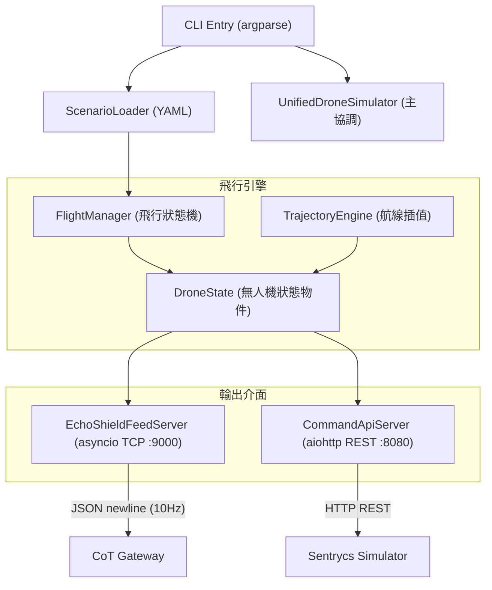
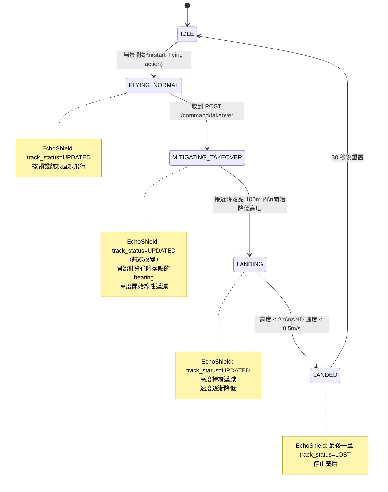

# 統一無人機模擬器（Unified Drone Simulator）規格

---

| 欄位 | 內容 |
|------|------|
| **文件編號** | 02 |
| **版本** | v0.3 |
| **日期** | 2026-04-23 |
| **作者** | 系統架構小組 |
| **狀態** | 草稿 |
| **機密等級** | PoC 內部使用 |

---

## 1. 目的與範圍

### 1.1 為何從兩個獨立模擬器改為統一設計

原始架構中，EchoShield 模擬器與 Sentrycs 模擬器各自維護一份獨立的無人機位置狀態。這導致兩個問題：

1. **狀態不一致**：兩個模擬器各自計算航跡，難以確保位置資料完全同步
2. **接管閉環無法實現**：Sentrycs 下令接管後，EchoShield 無法感知航線已改變

**統一無人機模擬器（Unified Drone Simulator，UDS）** 解決這兩個問題：

- **單一真實來源（Single Source of Truth）**：所有無人機的飛行狀態由 UDS 集中管理
- **接管閉環**：Sentrycs 向 UDS 發送接管指令後，UDS 改變航線，EchoShield TCP Feed 自然反映航線改變
- **PoC 驗收可重現**：統一狀態機確保每次場景執行結果一致

### 1.2 兩個輸出介面

UDS 提供兩個獨立輸出介面，各自服務不同的消費端：

| 介面 | 協定 | Port | 消費端 | 用途 |
|------|------|------|--------|------|
| EchoShield TCP Feed | TCP（換行分隔 JSON）| 9000 | CoT Gateway（EchodyneAdapter）| 雷達航跡資料，10 Hz |
| Sentrycs Query & Command API | HTTP REST | 8080 | Sentrycs Simulator | 查詢無人機狀態、發送接管指令 |

### 1.3 PoC 部署

- **部署位置**：展示環境主機（`127.0.0.1`）
- **無需真實硬體**：UDS 完全取代 EchoShield 實體雷達與 Sentrycs 的位置資料來源
- **單一 Python 程式**：`unified_drone_simulator.py`，以 asyncio 同時驅動兩個輸出介面

### 1.4 與 Map Simulator 的關係

Unified Drone Simulator 與 Map Simulator 形成「推送-登錄」關係：

1. **UDS 是資料生產者**：負責計算無人機飛行軌跡與狀態
2. **Map Simulator 是資料中介**：維護中央物件登錄表，供感測器模擬器查詢
3. **感測器模擬器是消費者**：EchoShield Simulator 和 Sentrycs Simulator 只向 Map Simulator 查詢，不直接與 UDS 互動（接管指令除外）

UDS 在每次主迴圈更新（1/update_hz 秒）後，呼叫 `POST /objects/update` 將所有活躍無人機的最新狀態推送至 Map Simulator（預設 localhost:8090）。

---

## 2. 功能需求

| ID | 需求描述 | 優先級 |
|----|---------|-------|
| FR-UDS-001 | 維護每架無人機的飛行狀態（位置、速度、方向、高度），每個時間步更新 | 必要 |
| FR-UDS-002 | TCP Server Port 9000，以 10 Hz 輸出 EchoShield JSON 格式（換行分隔）| 必要 |
| FR-UDS-003 | HTTP REST Server Port 8080，提供 Sentrycs Query API（GET /status, GET /drones）和 Command API（POST /command/takeover）| 必要 |
| FR-UDS-004 | 支援接管指令（POST /command/takeover），收到後立即改變目標無人機的航線至降落點 | 必要 |
| FR-UDS-005 | 飛行狀態機：IDLE → FLYING_NORMAL → MITIGATING_TAKEOVER → LANDING → LANDED | 必要 |
| FR-UDS-006 | 降落偵測：高度 ≤ 2m 且速度 ≤ 0.5m/s 時自動轉為 LANDED 狀態 | 必要 |
| FR-UDS-007 | 從 YAML 場景檔載入初始飛行場景（無人機清單、起始位置、速度、航向、降落點）| 必要 |
| FR-UDS-008 | 支援直線飛行、轉向飛行、降落軌跡插值計算（WGS84 座標）| 必要 |
| FR-UDS-009 | 更新頻率可設定（預設 10 Hz，範圍 1–20 Hz）| 重要 |
| FR-UDS-010 | 支援多架無人機同時飛行（PoC 最多 10 架）| 重要 |
| FR-UDS-011 | CLI 介面：--scenario, --echo-port, --api-port, --hz, --verbose | 必要 |
| FR-UDS-012 | 錯誤模擬：TCP 中斷、資料延遲、封包遺失率（百分比設定）| 選配 |
| FR-UDS-013 | 座標系使用 WGS84（Haversine 距離計算、bearing 計算、座標偏移）| 必要 |
| FR-UDS-014 | LANDED 後自動停止 EchoShield TCP 廣播（最後一筆輸出 track_status: LOST）| 必要 |
| FR-UDS-015 | bearing 轉向平滑（每步最多轉 30°，避免瞬間跳變）| 必要 |

---

## 3. 整體技術架構



---

## 4. 飛行狀態機設計

### 4.1 狀態圖



### 4.2 狀態轉移表

| 狀態 | 進入條件 | EchoShield track_status | 說明 |
|------|---------|------------------------|------|
| `IDLE` | 初始 / LANDED 後 30s | 不廣播 | 等待場景開始 |
| `FLYING_NORMAL` | 場景開始 | `UPDATED`（每 100ms）| 按預設航線直線飛行 |
| `MITIGATING_TAKEOVER` | 收到 POST /command/takeover | `UPDATED`（方向改變）| 計算 bearing 至降落點，高度遞減開始 |
| `LANDING` | 距降落點 < 100m | `UPDATED`（持續更新）| 高度持續降低，速度逐漸減慢 |
| `LANDED` | 高度 ≤ 2m AND 速度 ≤ 0.5m/s | `LOST`（最後一筆）| 停止廣播，30s 後回 IDLE |

---

## 5. EchoShield 資料輸出介面（TCP Port 9000）

### 5.1 連線規格

| 項目 | 規格 |
|------|------|
| 協定 | TCP（無 SSL，本機通訊）|
| Port | 9000 |
| 訊息格式 | 換行分隔 JSON（`\n`）|
| 更新頻率 | 10 Hz（每 100ms 一筆）|
| 多架支援 | 每個更新週期輸出所有活躍無人機（各一行 JSON）|
| 廣播模式 | 支援多個並行 TCP 客戶端連線 |

### 5.2 JSON 格式（完整）

```json
{
  "track_id": "TRK-001",
  "lat": 25.0584745,
  "lon": 121.5654089,
  "altitude_m": 100.8,
  "velocity_ms": 15.1,
  "azimuth_deg": 180.2,
  "elevation_deg": -1.4,
  "timestamp": "2026-04-22T08:00:01.000Z",
  "track_status": "UPDATED",
  "classification": "DRONE",
  "snr_db": 22.4,
  "rcs_dbsm": -11.3
}
```

### 5.3 欄位說明

| 欄位 | 型別 | 說明 |
|------|------|------|
| `track_id` | string | 無人機識別碼（如 `TRK-001`，對應 drone_id）|
| `lat` | float | WGS84 緯度（小數點後 7 位）|
| `lon` | float | WGS84 經度（小數點後 7 位）|
| `altitude_m` | float | 高度（公尺，HAE，小數點後 1 位）|
| `velocity_ms` | float | 速度（m/s，小數點後 1 位）|
| `azimuth_deg` | float | 方位角（度，正北為 0，順時針，小數點後 1 位）|
| `elevation_deg` | float | 仰角（度，固定 0.0）|
| `timestamp` | string | ISO 8601 UTC，精確到毫秒（`YYYY-MM-DDTHH:MM:SS.sssZ`）|
| `track_status` | string | `UPDATED`（飛行中）/ `LOST`（LANDED 後最後一筆）|
| `classification` | string | 固定 `DRONE` |
| `snr_db` | float | 訊雜比（dB），場景設定值 |
| `rcs_dbsm` | float | 雷達截面積（dBsm），場景設定值 |

> **注意**：無人機 LANDED 後，UDS 輸出最後一筆 `track_status: "LOST"`，之後停止廣播該無人機。

---

## 6. Sentrycs Query & Command API（REST Port 8080）

> **架構更新說明（v0.2）**：`GET /status/{drone_id}` 位置查詢功能已由 **Map Simulator（:8090）** 承接。感測器模擬器（EchoShield Simulator、Sentrycs Simulator）改向 Map Simulator 查詢物件位置。UDS 的 :8080 REST API 現在僅保留 **接管指令**（`POST /command/takeover`）和 **列出無人機**（`GET /drones`）功能。

### 6.1 GET /status/{drone_id}

查詢無人機當前狀態：

**Response 200 OK:**
```json
{
  "drone_id": "TRK-001",
  "lat": 25.0330,
  "lon": 121.5654,
  "alt_m": 120.5,
  "velocity_ms": 15.0,
  "azimuth_deg": 180.0,
  "flight_state": "FLYING_NORMAL",
  "model": "DJI Mavic 3",
  "operator_lat": 25.0310,
  "operator_lon": 121.5634,
  "is_landed": false
}
```

**Response 404:**
```json
{"error": "not found"}
```

### 6.2 POST /command/takeover

接管指令，觸發無人機改變航線飛往降落點：

**Request Body:**
```json
{
  "drone_id": "TRK-001",
  "target_lat": 25.0250,
  "target_lon": 121.5654,
  "target_alt_m": 0.0,
  "descent_speed_ms": 3.0
}
```

**Response 200 OK:**
```json
{
  "status": "accepted",
  "drone_id": "TRK-001",
  "previous_state": "FLYING_NORMAL",
  "new_state": "MITIGATING_TAKEOVER",
  "estimated_landing_s": 45.2
}
```

**Response 400:**
```json
{
  "status": "error",
  "reason": "drone_id not found or already landed"
}
```

### 6.3 GET /drones

列出所有活躍無人機：

**Response 200 OK:**
```json
{
  "drones": [
    {"drone_id": "TRK-001", "model": "DJI Mavic 3", "flight_state": "FLYING_NORMAL"},
    {"drone_id": "TRK-002", "model": "DJI Matrice 30T", "flight_state": "MITIGATING_TAKEOVER"}
  ]
}
```

---

## 7. 軌跡引擎（TrajectoryEngine）設計

### 7.1 座標計算基礎

所有座標計算使用 WGS84 球面模型（地球半徑 6,371,000m）：

- **Haversine 距離**：計算兩點球面距離（公尺）
- **Bearing 計算**：計算從點 1 到點 2 的正北順時針方位角（度）
- **座標偏移**：從給定座標往指定方向偏移指定距離

### 7.2 完整 Python 實作

```python
def haversine_distance(lat1: float, lon1: float, lat2: float, lon2: float) -> float:
    """計算兩 WGS84 座標間距離（公尺）"""
    R = 6371000
    phi1, phi2 = math.radians(lat1), math.radians(lat2)
    dphi = math.radians(lat2 - lat1)
    dlambda = math.radians(lon2 - lon1)
    a = math.sin(dphi/2)**2 + math.cos(phi1)*math.cos(phi2)*math.sin(dlambda/2)**2
    return R * 2 * math.atan2(math.sqrt(a), math.sqrt(1-a))

def bearing_to(lat1: float, lon1: float, lat2: float, lon2: float) -> float:
    """計算從點 1 到點 2 的 bearing（度，正北為 0，順時針）"""
    lat1, lat2 = math.radians(lat1), math.radians(lat2)
    dlon = math.radians(lon2 - lon1)
    x = math.sin(dlon) * math.cos(lat2)
    y = math.cos(lat1) * math.sin(lat2) - math.sin(lat1) * math.cos(lat2) * math.cos(dlon)
    return (math.degrees(math.atan2(x, y)) + 360) % 360

def offset_position(lat: float, lon: float, bearing_deg: float, distance_m: float) -> tuple:
    """從座標往指定方向偏移指定距離，回傳 (new_lat, new_lon)"""
    R = 6371000
    d = distance_m / R
    lat_r = math.radians(lat)
    lon_r = math.radians(lon)
    b = math.radians(bearing_deg)
    new_lat = math.asin(math.sin(lat_r)*math.cos(d) + math.cos(lat_r)*math.sin(d)*math.cos(b))
    new_lon = lon_r + math.atan2(math.sin(b)*math.sin(d)*math.cos(lat_r), math.cos(d)-math.sin(lat_r)*math.sin(new_lat))
    return math.degrees(new_lat), math.degrees(new_lon)
```

### 7.3 飛行更新邏輯

- **FLYING_NORMAL**：依當前 `heading_deg` 直線前進 `velocity_ms × dt` 公尺
- **MITIGATING_TAKEOVER / LANDING**：
  1. 計算往降落點的 bearing
  2. 平滑轉向（每步最多 30°）
  3. 前進 `velocity_ms × dt` 公尺
  4. 高度線性遞減（每步 `descent_speed_ms × dt` 公尺）

### 7.4 平滑轉向

```python
def smooth_heading(current: float, target: float, max_turn_deg: float = 30.0) -> float:
    """每步最多轉 max_turn_deg 度，避免瞬間跳變"""
    diff = ((target - current + 180) % 360) - 180
    if abs(diff) <= max_turn_deg:
        return target
    return (current + math.copysign(max_turn_deg, diff)) % 360
```

---

## 8. 場景腳本設計（YAML 格式）

### 8.1 場景一：單機入侵

```yaml
scenario:
  name: "single_drone_invasion"
  description: "單架 DJI Mavic 3 從北方入侵，Sentrycs 識別並接管"
  update_hz: 10
  servers:
    echoshield_tcp_port: 9000
    command_api_port: 8080

  drones:
    - drone_id: "TRK-001"
      model: "DJI Mavic 3"
      start_lat: 25.0598
      start_lon: 121.5654
      start_alt_m: 120.0
      speed_ms: 15.0
      heading_deg: 180.0
      operator_bearing_deg: 225
      operator_distance_m: 300
      waypoints:
        - lat: 25.0330
          lon: 121.5654
          alt_m: 100.0
      landing_point:
        lat: 25.0250
        lon: 121.5654
        alt_m: 0.0
        descent_speed_ms: 3.0

  timeline:
    - at_s: 0
      action: start_flying
      drone_id: "TRK-001"
    # Sentrycs 模擬器在 t=10s 開始識別（由 Sentrycs Simulator 場景設定，非此處控制）
    # 接管指令由 Sentrycs Simulator 在 t=25s 呼叫 POST /command/takeover
```

### 8.2 場景二：無人機群（5 架）

```yaml
scenario:
  name: "drone_swarm"
  description: "5 架不同型號無人機從不同方向入侵"
  update_hz: 10
  servers:
    echoshield_tcp_port: 9000
    command_api_port: 8080

  drones:
    - drone_id: "TRK-001"
      model: "DJI Mavic 3"
      start_lat: 25.0598
      start_lon: 121.5654
      start_alt_m: 120.0
      speed_ms: 15.0
      heading_deg: 180.0
      operator_bearing_deg: 225
      operator_distance_m: 300
      waypoints: [{lat: 25.0330, lon: 121.5654, alt_m: 100.0}]
      landing_point: {lat: 25.0250, lon: 121.5654, alt_m: 0.0, descent_speed_ms: 3.0}
    - drone_id: "TRK-002"
      model: "DJI Matrice 30T"
      start_lat: 25.0330
      start_lon: 121.5954
      start_alt_m: 150.0
      speed_ms: 18.0
      heading_deg: 270.0
      operator_bearing_deg: 90
      operator_distance_m: 400
      waypoints: [{lat: 25.0330, lon: 121.5654, alt_m: 120.0}]
      landing_point: {lat: 25.0330, lon: 121.5350, alt_m: 0.0, descent_speed_ms: 4.0}
    # TRK-003, TRK-004, TRK-005 類似設定...
```

---

## 9. Python 完整類別介面

```python
# unified_drone_simulator.py

import asyncio
import math
from dataclasses import dataclass, field
from enum import Enum, auto
from typing import Optional, Dict, List
from datetime import datetime, timezone
import json


class FlightState(Enum):
    IDLE = auto()
    FLYING_NORMAL = auto()
    MITIGATING_TAKEOVER = auto()  # 收到接管指令，正在改變航線
    LANDING = auto()              # 接近降落點，高度遞減中
    LANDED = auto()               # 已落地（高度<=2m, 速度<=0.5m/s）


@dataclass
class TakeoverCommand:
    drone_id: str
    target_lat: float
    target_lon: float
    target_alt_m: float
    descent_speed_ms: float = 3.0


@dataclass
class DroneState:
    drone_id: str
    model: str
    lat: float
    lon: float
    alt_m: float
    velocity_ms: float
    heading_deg: float
    operator_lat: float
    operator_lon: float
    flight_state: FlightState = FlightState.IDLE
    takeover_cmd: Optional[TakeoverCommand] = None
    snr_db: float = 22.0
    rcs_dbsm: float = -12.0

    def to_echoshield_json(self) -> dict:
        status = "LOST" if self.flight_state == FlightState.LANDED else (
            "NEW" if self.flight_state == FlightState.FLYING_NORMAL else "UPDATED"
        )
        return {
            "track_id": self.drone_id,
            "lat": round(self.lat, 7),
            "lon": round(self.lon, 7),
            "altitude_m": round(self.alt_m, 1),
            "velocity_ms": round(self.velocity_ms, 1),
            "azimuth_deg": round(self.heading_deg, 1),
            "elevation_deg": 0.0,
            "timestamp": datetime.now(timezone.utc).strftime("%Y-%m-%dT%H:%M:%S.%f")[:-3] + "Z",
            "track_status": status,
            "classification": "DRONE",
            "snr_db": self.snr_db,
            "rcs_dbsm": self.rcs_dbsm,
        }

    def to_sentrycs_status(self) -> dict:
        return {
            "drone_id": self.drone_id,
            "lat": self.lat,
            "lon": self.lon,
            "alt_m": self.alt_m,
            "velocity_ms": self.velocity_ms,
            "azimuth_deg": self.heading_deg,
            "flight_state": self.flight_state.name,
            "model": self.model,
            "operator_lat": self.operator_lat,
            "operator_lon": self.operator_lon,
            "is_landed": self.flight_state == FlightState.LANDED,
        }


class TrajectoryEngine:

    @staticmethod
    def haversine_distance(lat1: float, lon1: float, lat2: float, lon2: float) -> float:
        R = 6371000
        phi1, phi2 = math.radians(lat1), math.radians(lat2)
        dphi = math.radians(lat2 - lat1)
        dlambda = math.radians(lon2 - lon1)
        a = math.sin(dphi/2)**2 + math.cos(phi1)*math.cos(phi2)*math.sin(dlambda/2)**2
        return R * 2 * math.atan2(math.sqrt(a), math.sqrt(1-a))

    @staticmethod
    def bearing_to(lat1: float, lon1: float, lat2: float, lon2: float) -> float:
        lat1, lat2 = math.radians(lat1), math.radians(lat2)
        dlon = math.radians(lon2 - lon1)
        x = math.sin(dlon) * math.cos(lat2)
        y = math.cos(lat1) * math.sin(lat2) - math.sin(lat1) * math.cos(lat2) * math.cos(dlon)
        return (math.degrees(math.atan2(x, y)) + 360) % 360

    @staticmethod
    def offset_position(lat: float, lon: float, bearing_deg: float, distance_m: float) -> tuple:
        R = 6371000
        d = distance_m / R
        lat_r = math.radians(lat)
        lon_r = math.radians(lon)
        b = math.radians(bearing_deg)
        new_lat = math.asin(math.sin(lat_r)*math.cos(d) + math.cos(lat_r)*math.sin(d)*math.cos(b))
        new_lon = lon_r + math.atan2(math.sin(b)*math.sin(d)*math.cos(lat_r), math.cos(d)-math.sin(lat_r)*math.sin(new_lat))
        return math.degrees(new_lat), math.degrees(new_lon)

    @staticmethod
    def smooth_heading(current: float, target: float, max_turn_deg: float = 30.0) -> float:
        diff = ((target - current + 180) % 360) - 180
        if abs(diff) <= max_turn_deg:
            return target
        return (current + math.copysign(max_turn_deg, diff)) % 360

    def update_drone(self, drone: DroneState, dt: float) -> DroneState:
        if drone.flight_state in (FlightState.IDLE, FlightState.LANDED):
            return drone
        if drone.flight_state == FlightState.FLYING_NORMAL:
            new_lat, new_lon = self.offset_position(drone.lat, drone.lon, drone.heading_deg, drone.velocity_ms * dt)
            drone.lat, drone.lon = new_lat, new_lon
        elif drone.flight_state in (FlightState.MITIGATING_TAKEOVER, FlightState.LANDING):
            cmd = drone.takeover_cmd
            target_bearing = self.bearing_to(drone.lat, drone.lon, cmd.target_lat, cmd.target_lon)
            drone.heading_deg = self.smooth_heading(drone.heading_deg, target_bearing)
            new_lat, new_lon = self.offset_position(drone.lat, drone.lon, drone.heading_deg, drone.velocity_ms * dt)
            drone.lat, drone.lon = new_lat, new_lon
            if drone.alt_m > cmd.target_alt_m:
                drone.alt_m = max(cmd.target_alt_m, drone.alt_m - cmd.descent_speed_ms * dt)
            dist = self.haversine_distance(drone.lat, drone.lon, cmd.target_lat, cmd.target_lon)
            if dist < 5.0 and drone.alt_m <= 2.0:
                drone.velocity_ms = 0.0
                drone.alt_m = 0.0
                drone.flight_state = FlightState.LANDED
        return drone


class FlightManager:

    def __init__(self):
        self.drones: Dict[str, DroneState] = {}
        self.trajectory_engine = TrajectoryEngine()

    def add_drone(self, drone: DroneState) -> None:
        self.drones[drone.drone_id] = drone

    def apply_takeover(self, cmd: TakeoverCommand) -> bool:
        if cmd.drone_id not in self.drones:
            return False
        drone = self.drones[cmd.drone_id]
        if drone.flight_state in (FlightState.LANDED, FlightState.IDLE):
            return False
        drone.takeover_cmd = cmd
        drone.flight_state = FlightState.MITIGATING_TAKEOVER
        return True

    def update_all(self, dt: float) -> None:
        for drone in self.drones.values():
            self.trajectory_engine.update_drone(drone, dt)

    def get_status(self, drone_id: str) -> Optional[dict]:
        drone = self.drones.get(drone_id)
        return drone.to_sentrycs_status() if drone else None

    def get_all_echoshield_json(self) -> List[dict]:
        return [d.to_echoshield_json() for d in self.drones.values()]


class EchoShieldFeedServer:

    def __init__(self, flight_manager: FlightManager, host: str = "0.0.0.0", port: int = 9000, update_hz: float = 10.0):
        self.flight_manager = flight_manager
        self.host = host
        self.port = port
        self.interval = 1.0 / update_hz
        self._clients: List[asyncio.StreamWriter] = []

    async def start(self) -> None:
        server = await asyncio.start_server(self._handle_client, self.host, self.port)
        asyncio.create_task(self._broadcast_loop())
        async with server:
            await server.serve_forever()

    async def _handle_client(self, reader: asyncio.StreamReader, writer: asyncio.StreamWriter) -> None:
        self._clients.append(writer)
        try:
            await reader.read()
        finally:
            self._clients.remove(writer)
            writer.close()

    async def _broadcast_loop(self) -> None:
        while True:
            tracks = self.flight_manager.get_all_echoshield_json()
            for track in tracks:
                line = json.dumps(track) + "\n"
                for writer in list(self._clients):
                    try:
                        writer.write(line.encode())
                        await writer.drain()
                    except Exception:
                        pass
            await asyncio.sleep(self.interval)


class CommandApiServer:

    def __init__(self, flight_manager: FlightManager, port: int = 8080):
        self.flight_manager = flight_manager
        self.port = port

    async def start(self) -> None:
        from aiohttp import web
        app = web.Application()
        app.router.add_get("/status/{drone_id}", self._get_status)
        app.router.add_get("/drones", self._list_drones)
        app.router.add_post("/command/takeover", self._post_takeover)
        runner = web.AppRunner(app)
        await runner.setup()
        site = web.TCPSite(runner, "localhost", self.port)
        await site.start()

    async def _get_status(self, request):
        from aiohttp import web
        drone_id = request.match_info["drone_id"]
        status = self.flight_manager.get_status(drone_id)
        if not status:
            return web.json_response({"error": "not found"}, status=404)
        return web.json_response(status)

    async def _list_drones(self, request):
        from aiohttp import web
        drones = [
            {"drone_id": d.drone_id, "model": d.model, "flight_state": d.flight_state.name}
            for d in self.flight_manager.drones.values()
        ]
        return web.json_response({"drones": drones})

    async def _post_takeover(self, request):
        from aiohttp import web
        body = await request.json()
        cmd = TakeoverCommand(
            drone_id=body["drone_id"],
            target_lat=body["target_lat"],
            target_lon=body["target_lon"],
            target_alt_m=body.get("target_alt_m", 0.0),
            descent_speed_ms=body.get("descent_speed_ms", 3.0),
        )
        success = self.flight_manager.apply_takeover(cmd)
        if not success:
            return web.json_response({"status": "error", "reason": "drone_id not found or already landed"}, status=400)
        drone = self.flight_manager.drones[cmd.drone_id]
        dist = TrajectoryEngine.haversine_distance(drone.lat, drone.lon, cmd.target_lat, cmd.target_lon)
        eta = dist / drone.velocity_ms + (drone.alt_m / cmd.descent_speed_ms)
        return web.json_response({
            "status": "accepted",
            "drone_id": cmd.drone_id,
            "previous_state": "FLYING_NORMAL",
            "new_state": "MITIGATING_TAKEOVER",
            "estimated_landing_s": round(eta, 1),
        })


class UnifiedDroneSimulator:

    def __init__(self, scenario_file: str, echo_port: int = 9000, api_port: int = 8080,
                 map_sim_url: str = "http://localhost:8090", update_hz: float = 10.0):
        self.scenario_file = scenario_file
        self.echo_port = echo_port
        self.api_port = api_port
        self.map_sim_url = map_sim_url
        self.update_hz = update_hz
        self.flight_manager = FlightManager()

    async def run(self) -> None:
        scenario = ScenarioLoader.load(self.scenario_file)
        for drone_cfg in scenario["drones"]:
            op_lat, op_lon = TrajectoryEngine.offset_position(
                drone_cfg["start_lat"], drone_cfg["start_lon"],
                drone_cfg["operator_bearing_deg"], drone_cfg["operator_distance_m"]
            )
            drone = DroneState(
                drone_id=drone_cfg["drone_id"],
                model=drone_cfg["model"],
                lat=drone_cfg["start_lat"],
                lon=drone_cfg["start_lon"],
                alt_m=drone_cfg["start_alt_m"],
                velocity_ms=drone_cfg["speed_ms"],
                heading_deg=drone_cfg["heading_deg"],
                operator_lat=op_lat,
                operator_lon=op_lon,
                flight_state=FlightState.FLYING_NORMAL,
            )
            self.flight_manager.add_drone(drone)

        echo_server = EchoShieldFeedServer(self.flight_manager, port=self.echo_port, update_hz=self.update_hz)
        api_server = CommandApiServer(self.flight_manager, port=self.api_port)
        dt = 1.0 / self.update_hz

        async def update_loop():
            while True:
                self.flight_manager.update_all(dt)
                await asyncio.sleep(dt)

        async def push_loop():
            """每秒 push 所有無人機狀態至 Map Simulator"""
            import aiohttp
            while True:
                async with aiohttp.ClientSession() as session:
                    for drone in self.flight_manager.drones.values():
                        payload = {
                            "drone_id": drone.drone_id,
                            "lat": drone.lat,
                            "lon": drone.lon,
                            "alt_m": drone.alt_m,
                            "speed_ms": drone.velocity_ms,
                            "heading_deg": drone.heading_deg,
                            "status": drone.flight_state.name,
                            "timestamp": datetime.now(timezone.utc).strftime(
                                "%Y-%m-%dT%H:%M:%S.%f")[:-3] + "Z",
                        }
                        try:
                            await session.post(f"{self.map_sim_url}/objects/update", json=payload)
                        except Exception as e:
                            logger.warning(f"UDS: push to Map Simulator failed: {e}")
                await asyncio.sleep(1.0)

        await asyncio.gather(
            echo_server.start(),
            api_server.start(),
            update_loop(),
            push_loop(),
        )
```

---

## 10. CLI 介面

```bash
python unified_drone_simulator.py \
  --scenario scenarios/single_drone_invasion.yaml \
  --echo-port 9000 \
  --api-port 8080 \
  --hz 10 \
  --verbose

# 參數說明：
# --scenario   場景 YAML 設定檔路徑（必要）
# --echo-port  EchoShield TCP 輸出 Port（預設 9000）
# --api-port   Sentrycs Query & Command API Port（預設 8080）
# --hz             更新頻率 Hz（預設 10，範圍 1-20）
# --map-sim-url    Map Simulator URL（預設 http://localhost:8090）
# --verbose        詳細日誌輸出
```

---

## 11. 錯誤模擬

| 功能 | 設定方式 | 說明 |
|------|---------|------|
| TCP 連線中斷模擬 | YAML `error_simulation.tcp_drop_after_s` | 模擬 N 秒後斷開所有客戶端連線 |
| 資料延遲 | YAML `error_simulation.delay_ms` | 每筆輸出前人工延遲（毫秒）|
| 封包遺失率 | YAML `error_simulation.drop_rate` | 0.0–1.0，隨機丟棄該比例的輸出 |
| LANDED 後停止廣播 | 自動 | 狀態為 LANDED 的無人機輸出最後一筆 LOST 後停止 |

---

## 12. 單元測試需求

| ID | 測試案例 | 測試方法 | 預期結果 |
|----|---------|---------|---------|
| TR-UDS-001 | 正常飛行位置更新正確性 | 飛行 1 秒，速度 15m/s，heading=180° | 緯度減少約 0.000135°（約 15m）|
| TR-UDS-002 | 接管指令後航線改變 | 呼叫 apply_takeover，更新 1 步 | flight_state=MITIGATING_TAKEOVER，heading 朝降落點 |
| TR-UDS-003 | 降落偵測（高度≤2m 且速度≤0.5m/s）| 設置 alt_m=1.0, velocity_ms=0.3，更新 1 步 | flight_state=LANDED |
| TR-UDS-004 | Haversine 距離計算精度 | 計算台北到台中距離（已知約 150km）| 誤差 < 0.1% |
| TR-UDS-005 | bearing 計算正確性 | 從 (25.0, 121.5) 到正北方點 | bearing ≈ 0° |
| TR-UDS-006 | EchoShield JSON 格式驗證 | 呼叫 to_echoshield_json()，驗證所有必填欄位 | 所有欄位存在且型別正確 |
| TR-UDS-007 | REST API /status 和 /command/takeover | 使用 aiohttp TestClient 模擬請求 | 200 OK 並回傳正確 JSON |
| TR-UDS-008 | 場景 YAML 載入 | 載入 single_drone_invasion.yaml | DroneState 正確初始化 |
| TR-UDS-009 | 多架無人機並行狀態獨立性 | TRK-001 LANDED 時，TRK-002 仍 FLYING_NORMAL | 各無人機狀態互不干擾 |
| TR-UDS-010 | 平滑轉向限制（≤30°/步）| heading=0°，目標 bearing=90°，更新 1 步 | heading=30°（不超過 30°）|

---

## 13. 依賴清單

```
# requirements.txt
asyncio (stdlib)
aiohttp>=3.9        # REST API Server（CommandApiServer）
PyYAML>=6.0         # 場景設定檔解析
pytest>=7.0         # 單元測試框架
pytest-asyncio>=0.23 # asyncio 測試支援
```

### 專案目錄結構

```
unified_drone_simulator/
├── unified_drone_simulator.py    # CLI 入口 + UnifiedDroneSimulator
├── simulator/
│   ├── __init__.py
│   ├── flight_manager.py         # FlightManager
│   ├── drone_state.py            # DroneState, FlightState, TakeoverCommand
│   ├── trajectory_engine.py      # TrajectoryEngine
│   ├── echoshield_feed_server.py # EchoShieldFeedServer（TCP）
│   └── command_api_server.py     # CommandApiServer（aiohttp REST）
├── scenarios/
│   ├── single_drone_invasion.yaml
│   └── drone_swarm.yaml
├── tests/
│   ├── test_trajectory.py
│   ├── test_flight_manager.py
│   └── test_api_server.py
└── requirements.txt
```
