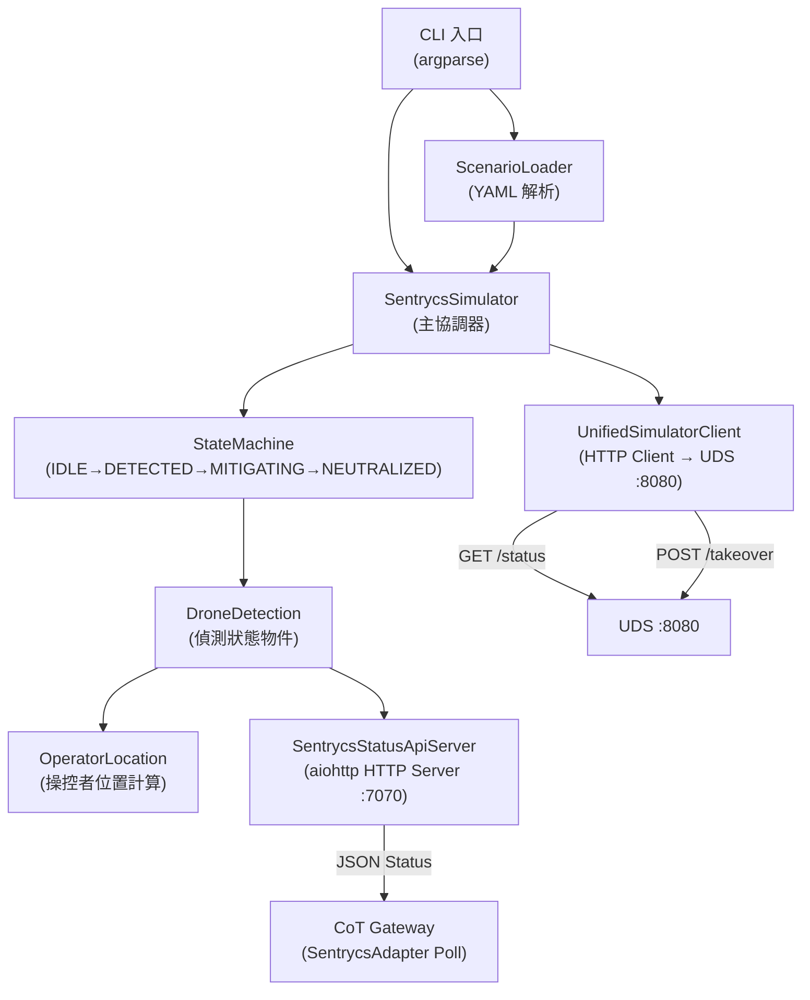
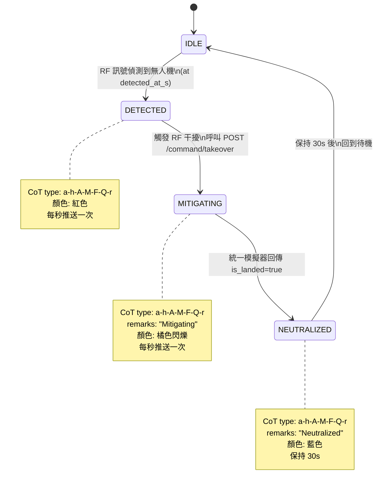

# Sentrycs 模擬器規格

---

| 欄位 | 內容 |
|------|------|
| **文件編號** | 03 |
| **版本** | v0.4 |
| **日期** | 2026-04-22（修訂：改從 Map Simulator 取得無人機位置，不再直接查詢 UDS）|
| **作者** | 系統架構小組 |
| **狀態** | 草稿 |

---

## 1. 目的與範圍

### 1.1 為何需要模擬器

Sentrycs C-UAS 是完全被動式 RF 偵測系統，採用製造商通訊協議操縱（CoRF）技術，偵測距離達 8km。在 PoC 階段無法取得真實設備，需以 Python 腳本模擬其行為：

1. **替代真實設備**：模擬 Detected → Mitigating → Neutralized 的完整作戰流程
2. **驗證 Gateway 路由**：透過 CoT Gateway 的 SentrycsAdapter 統一融合所有感測器資料
3. **操控者位置**：模擬 RF 定向追蹤操控者位置的功能

### 1.2 架構：Sentrycs 透過 CoT Gateway 融合輸出

**重要架構特點**：Sentrycs 模擬器以 **HTTP JSON Status API（Port 7070）** 對外提供偵測數據，由 CoT Gateway 的 SentrycsAdapter 輪詢後，與 EchoShield 雷達資料融合，統一推送至 TAK Server。

```
Unified Drone Simulator (:8080 REST API)
         ↑ GET /status/{drone_id}    ↑ POST /command/takeover
         └────── Sentrycs Simulator ─┘
                       │ HTTP JSON Status API (:7070)
                       ▼
               CoT Gateway (SentrycsAdapter)
                       │ 融合後 CoT XML
                       ▼
                  TAK Server ──▶ ATAK Android
```

優點：
- 所有 CoT 生成邏輯集中在 CoT Gateway，架構更清晰
- Gateway 可同時融合雷達位置（高精度）與 RF 型號/狀態（高識別度）
- Sentrycs Simulator 職責單純：維護狀態機 + 提供 JSON 查詢介面

### 1.3 與統一模擬器的關係（保持原有設計）

Sentrycs 模擬器仍負責：
- **位置查詢**：定期向 **Map Simulator（Port 8090）** 查詢 RF 偵測範圍（≤8km）內的物件（`GET /objects?lat=&lon=&radius_m=8000`），取代直接呼叫 UDS `/status/{drone_id}`
- 在 MITIGATING 時呼叫 `POST /command/takeover` 觸發接管
- 監測 `is_landed` 狀態，轉換為 NEUTRALIZED

差異：過去直接生成 CoT XML 推送 TAK Server，現在提供 HTTP JSON Status API（:7070），由 CoT Gateway 負責後續的 CoT 生成與推送。

### 1.4 與 Map Simulator 的關係

Sentrycs Simulator 改向 Map Simulator 查詢物件位置，而非直接呼叫 UDS：

| 操作 | 舊架構（直接查 UDS）| 新架構（透過 Map Simulator）|
|------|-------------------|-----------------------------|
| 查詢無人機位置 | `GET /status/{drone_id}` @ UDS :8080 | `GET /objects?lat=&lon=&radius_m=8000` @ Map Sim :8090 |
| 取得無人機列表 | `GET /drones` @ UDS :8080 | `GET /objects/all` @ Map Sim :8090（或 GET /objects）|
| 發送接管指令 | `POST /command/takeover` @ UDS :8080 | **不變**，仍呼叫 UDS :8080 |
| 落地偵測 | UDS `is_landed: true` | Map Sim `status: LANDED`（UDS push 狀態到 Map Sim）|

查詢中心（`lat/lon`）設為感測器安裝位置（場景設定），`radius_m=8000` 對應 Sentrycs 最大偵測距離 8km。

---

## 2. 功能需求

| ID | 需求描述 | 優先級 |
|----|---------|-------|
| FR-SC-001 | 實作 IDLE → DETECTED → MITIGATING → NEUTRALIZED → IDLE 狀態機 | 必要 |
| FR-SC-002 | 從 YAML 場景檔載入場景參數（TAK Server 位址、無人機型號、時序等）| 必要 |
| FR-SC-003 | 維護偵測狀態機（IDLE/DETECTED/MITIGATING/NEUTRALIZED），並透過 JSON API 提供當前狀態 | 必要 |
| FR-SC-004 | 提供 HTTP JSON 狀態 API（aiohttp, Port 7070），供 CoT Gateway SentrycsAdapter 輪詢 | 必要 |
| FR-SC-005 | 支援 DJI Mavic 3、DJI Matrice 30T、Autel EVO II 三種無人機型號 | 必要 |
| FR-SC-006 | 模擬操控者位置（無人機位置 offset 200–500m，方位角可設定）| 必要 |
| FR-SC-007 | JSON 輸出包含 operator_lat / operator_lon 欄位（由 CoT Gateway 產生操控者 CoT）| 必要 |
| FR-SC-008 | 狀態變化時立即輸出 JSON；穩定狀態下每秒輸出一次 | 必要 |
| FR-SC-009 | TCP Server 支援多 Client 同時連線；Client 斷線不影響其他 Client；Server 在無 Client 時繼續運行 | 必要 |
| FR-SC-010 | 提供 CLI 介面，支援 --scenario, --verbose 參數 | 必要 |
| FR-SC-011 | 向 Map Simulator REST API（Port 8090）定期查詢 RF 偵測範圍內物件（每 0.5 秒，GET /objects?radius_m=8000）| 必要 |
| FR-SC-012 | 當觸發 MITIGATING 時，呼叫 `POST /command/takeover` 發送接管指令給統一模擬器 | 必要 |
| FR-SC-013 | 持續監測統一模擬器回傳的 `is_landed` 欄位，一旦為 `true` 即推送 Neutralized CoT | 必要 |

---

## 3. 技術架構

### 3.1 概覽

Sentrycs Simulator 是一個同時扮演 **Client（查詢 UDS）** 與 **Server（提供 JSON API）** 的 Python asyncio 程式。
- **Client 端**：輪詢統一無人機模擬器 REST API（Port 8080）取得無人機位置與狀態；在接管時呼叫 `/command/takeover`
- **Server 端**：以 aiohttp 提供 JSON 狀態查詢 API（Port 7070），供 CoT Gateway SentrycsAdapter 輪詢取得偵測狀態

### 3.2 模組結構圖



### 3.3 主要類別

| 類別 | 職責 |
|------|------|
| `SentrycsSimulator` | 主協調器，驅動狀態機，協調 UDS 輪詢與 JSON API 服務 |
| `DroneDetection` | 單一偵測目標的完整狀態（位置、型號、偵測狀態、操控者） |
| `OperatorLocation` | 計算操控者位置（無人機位置 + bearing + distance offset）|
| `StateMachine` | 管理 IDLE→DETECTED→MITIGATING→NEUTRALIZED 狀態轉移 |
| `UnifiedSimulatorClient` | HTTP Client，呼叫 UDS REST API 取得位置，發送接管指令 |
| `SentrycsStatusApiServer` | aiohttp HTTP Server（Port 7070），對 CoT Gateway 提供 JSON 偵測狀態 |

---

## 4. 狀態機設計

### 4.1 狀態圖



### 4.2 狀態轉移規格

| 狀態 | CoT Type | 顏色 | 推送頻率 | 持續時間 |
|------|---------|------|---------|---------|
| `IDLE` | 無 | 無 | 不推送 | 直到 detected_at_s |
| `DETECTED` | `a-h-A-M-F-Q-r` | 紅色 | 每 1 秒 | 直到 mitigating_at_s |
| `MITIGATING` | `a-h-A-M-F-Q-r` | 橘色閃爍 | 每 1 秒 | 直到 neutralized_at_s |
| `NEUTRALIZED` | `a-h-A-M-F-Q-r` | 藍色 | 每 1 秒 | 30 秒後回 IDLE |

> **顏色規則**：TAK 依 remarks 欄位決定圖標顏色：
> - `DETECTED` → 紅色（無備註，預設 hostile）
> - `MITIGATING` → remarks 含 "Mitigating" → 橘色閃爍（TAK plugin 判斷）
> - `NEUTRALIZED` → remarks 含 "Neutralized" → 藍色

### 4.3 JSON Status API 回傳格式

每個活躍偵測目標（非 IDLE）由 `SentrycsStatusApiServer` 透過 `GET /detections` 提供，CoT Gateway SentrycsAdapter 以 1 Hz 輪詢取得：

```json
{
  "uid": "SENTRYCS-DJI-Mavic3-001",
  "model": "DJI Mavic 3",
  "detection_status": "DETECTED",
  "lat": 25.0330000,
  "lon": 121.5654000,
  "alt_m": 120.5,
  "velocity_ms": 15.0,
  "azimuth_deg": 180.0,
  "operator_lat": 25.0309929,
  "operator_lon": 121.5632836,
  "operator_distance_m": 300.0,
  "operator_bearing_deg": 225.0,
  "timestamp": "2026-04-22T08:00:05.000Z",
  "is_landed": false
}
```

**欄位說明**：

| 欄位 | 型別 | 說明 |
|------|------|------|
| `uid` | string | 偵測目標唯一 ID（`SENTRYCS-{MODEL}-{SEQ}`）|
| `model` | string | 無人機型號（`DJI Mavic 3` / `DJI Matrice 30T` / `Autel EVO II`）|
| `detection_status` | enum | `DETECTED` / `MITIGATING` / `NEUTRALIZED` |
| `lat`, `lon` | float | 無人機位置（從 UDS GET /status 取得，WGS84）|
| `alt_m` | float | 高度（HAE，公尺）|
| `velocity_ms` | float | 速度（m/s，從 UDS 取得）|
| `azimuth_deg` | float | 飛行方位角（度）|
| `operator_lat`, `operator_lon` | float | 操控者估計位置（WGS84）|
| `operator_distance_m` | float | 操控者距無人機距離（公尺）|
| `operator_bearing_deg` | float | 操控者相對無人機方位角（度）|
| `timestamp` | string | 感測時間（ISO 8601 UTC）|
| `is_landed` | boolean | 是否已落地（UDS is_landed=true 時設為 true）|

> **IDLE 狀態**：不包含在 `/detections` 回傳列表中。

---

## 5. 支援無人機型號

### 5.1 型號規格表

| 型號 | 重量 | 最大速度 | 最大飛行時間 | 最高高度 | RF 頻段 |
|------|------|---------|------------|---------|---------|
| DJI Mavic 3 | 895g | 21 m/s | 46 min | 6000m | 2.4/5.8 GHz OcuSync 3.0 |
| DJI Matrice 30T | 3770g | 23 m/s | 41 min | 7000m | 2.4/5.8 GHz OcuLink |
| Autel EVO II | 1191g | 20 m/s | 40 min | 7000m | 2.4/5.8 GHz SkyLink |

### 5.2 型號對應 CoT 格式

| 型號 | CoT callsign 格式 | uid 格式 |
|------|------------------|---------|
| DJI Mavic 3 | `DJI-Mavic3-{SEQ:03d}` | `SENTRYCS-DJI-Mavic3-{SEQ:03d}` |
| DJI Matrice 30T | `DJI-Matrice30T-{SEQ:03d}` | `SENTRYCS-DJI-Matrice30T-{SEQ:03d}` |
| Autel EVO II | `Autel-EVOII-{SEQ:03d}` | `SENTRYCS-Autel-EVOII-{SEQ:03d}` |

---

## 6. CoT XML 輸出格式（由 CoT Gateway CotGenerator 產生）

> **架構說明**：Sentrycs Simulator 不直接產生 CoT XML。以下格式由 CoT Gateway 的 CotGenerator 根據 SentrycsAdapter 轉換的 Track 物件產生，供開發人員理解 CotGenerator 的輸出規格。

### 6.1 DETECTED 狀態

```xml
<?xml version="1.0" encoding="UTF-8"?>
<event version="2.0"
       uid="SENTRYCS-DJI-Mavic3-001"
       type="a-h-A-M-F-Q-r"
       time="2025-07-10T08:00:00.000Z"
       start="2025-07-10T08:00:00.000Z"
       stale="2025-07-10T08:00:15.000Z"
       how="m-g">
  <point lat="25.0330" lon="121.5654" hae="120.5" ce="25.0" le="10.0"/>
  <detail>
    <contact callsign="DJI-Mavic3-001"/>
    <usericon iconsetpath="34ae1613-9645-4222-a9d2-e5f243dea2865/Military/Air_Enemy.png"/>
    <remarks>Sentrycs: Detected | Model: DJI Mavic 3 | Speed: 15.0m/s</remarks>
    <sensor model="DJI Mavic 3" status="Detected" source="Sentrycs"/>
    <operator lat="25.0310" lon="121.5634" distance_m="283" bearing_deg="225"/>
  </detail>
</event>
```

### 6.2 MITIGATING 狀態

```xml
<?xml version="1.0" encoding="UTF-8"?>
<event version="2.0"
       uid="SENTRYCS-DJI-Mavic3-001"
       type="a-h-A-M-F-Q-r"
       time="2025-07-10T08:00:20.000Z"
       start="2025-07-10T08:00:20.000Z"
       stale="2025-07-10T08:00:35.000Z"
       how="m-g">
  <point lat="25.0325" lon="121.5650" hae="115.0" ce="25.0" le="10.0"/>
  <detail>
    <contact callsign="DJI-Mavic3-001"/>
    <usericon iconsetpath="34ae1613-9645-4222-a9d2-e5f243dea2865/Military/Air_Enemy.png"/>
    <remarks>Sentrycs: Mitigating | Model: DJI Mavic 3 | RF Jamming Active</remarks>
    <sensor model="DJI Mavic 3" status="Mitigating" source="Sentrycs"/>
    <operator lat="25.0310" lon="121.5634" distance_m="283" bearing_deg="225"/>
  </detail>
</event>
```

### 6.3 NEUTRALIZED 狀態

```xml
<?xml version="1.0" encoding="UTF-8"?>
<event version="2.0"
       uid="SENTRYCS-DJI-Mavic3-001"
       type="a-h-A-M-F-Q-r"
       time="2025-07-10T08:00:35.000Z"
       start="2025-07-10T08:00:35.000Z"
       stale="2025-07-10T08:01:05.000Z"
       how="m-g">
  <point lat="25.0322" lon="121.5648" hae="110.0" ce="25.0" le="10.0"/>
  <detail>
    <contact callsign="DJI-Mavic3-001"/>
    <usericon iconsetpath="34ae1613-9645-4222-a9d2-e5f243dea2865/Military/Air_Enemy.png"/>
    <remarks>Sentrycs: Neutralized | Model: DJI Mavic 3 | RF Control Seized</remarks>
    <sensor model="DJI Mavic 3" status="Neutralized" source="Sentrycs"/>
    <operator lat="25.0310" lon="121.5634" distance_m="283" bearing_deg="225"/>
  </detail>
</event>
```

### 6.4 操控者位置 CoT

```xml
<?xml version="1.0" encoding="UTF-8"?>
<event version="2.0"
       uid="SENTRYCS-OPERATOR-DJI-Mavic3-001"
       type="a-h-G-U-C-I"
       time="2025-07-10T08:00:00.000Z"
       start="2025-07-10T08:00:00.000Z"
       stale="2025-07-10T08:00:15.000Z"
       how="m-g">
  <point lat="25.0310" lon="121.5634" hae="0.0" ce="50.0" le="9999999.0"/>
  <detail>
    <contact callsign="OPERATOR-DJI-Mavic3-001"/>
    <remarks>Sentrycs: Operator Location | Drone: DJI-Mavic3-001 | Distance: 283m</remarks>
  </detail>
</event>
```

### 6.5 CoT 欄位說明

| 欄位 | 說明 | 計算方式 |
|------|------|---------|
| `uid` | 全域唯一識別碼 | `SENTRYCS-{MODEL_NORMALIZED}-{SEQ:03d}` |
| `type` | CoT type（MIL-STD-2525C）| 固定 `a-h-A-M-F-Q-r`（無人機）/ `a-h-G-U-C-I`（操控者）|
| `time` | 訊息生成時間 | `datetime.utcnow().isoformat() + "Z"` |
| `start` | 事件開始時間 | 等於 `time` |
| `stale` | 訊息失效時間 | `time + 15 秒`（NEUTRALIZED 狀態用 30 秒）|
| `how` | 資料取得方式 | 固定 `m-g`（machine-generated）|
| `lat/lon` | 無人機/操控者位置 | 場景設定（無人機）/ 偏移計算（操控者）|
| `hae` | 高度（公尺，HAE）| 場景設定 |
| `ce` | 水平誤差圓（公尺）| Sentrycs RF 定位精度：25m |
| `le` | 垂直誤差（公尺）| 無人機：10m，操控者：9999999（未知）|
| `callsign` | 顯示名稱 | `{MODEL_SHORT}-{SEQ:03d}` |
| `remarks` | 狀態說明文字 | `Sentrycs: {STATUS} | Model: {MODEL} | ...` |

---

## 7. 操控者位置模擬

### 7.1 偏移計算算法

```python
import math
from geopy.distance import distance as geo_distance
from geopy import Point

def calculate_operator_position(
    drone_lat: float,
    drone_lon: float,
    bearing_deg: float,
    distance_m: float
) -> tuple[float, float]:
    """
    計算操控者位置（無人機位置向指定方向偏移）
    :param drone_lat: 無人機緯度
    :param drone_lon: 無人機經度
    :param bearing_deg: 偏移方位角（0=北, 90=東, 180=南, 270=西）
    :param distance_m: 偏移距離（200–500m）
    :return: (operator_lat, operator_lon)
    """
    drone_point = Point(drone_lat, drone_lon)
    operator_point = geo_distance(meters=distance_m).destination(
        drone_point, bearing=bearing_deg
    )
    return operator_point.latitude, operator_point.longitude
```

### 7.2 場景設定

- `operator_bearing_deg`：操控者相對無人機的方位角（從場景 YAML 設定）
- `operator_distance_m`：操控者與無人機的距離（200–500m）
- 操控者位置在場景執行期間保持固定（不移動）

### 7.3 操控者 CoT 規格

| 項目 | 值 |
|------|-----|
| CoT type | `a-h-G-U-C-I`（敵方地面戰鬥人員）|
| uid 格式 | `SENTRYCS-OPERATOR-{MODEL_NORMALIZED}-{SEQ:03d}` |
| `ce`（水平誤差）| 50m（RF 方向定位精度）|
| `le`（垂直誤差）| 9999999（地面目標，高度未知）|
| `hae` | 0.0（假設在地面）|

---

## 8. Sentrycs JSON Status API（Port 7070）

### 8.1 連線規格

| 項目 | 規格 |
|------|------|
| 框架 | aiohttp（Python 非同步 HTTP Server）|
| Port | 7070（可設定）|
| 協定 | HTTP（本機明文，不需 SSL）|
| 訊息格式 | JSON |
| 輪詢方 | CoT Gateway SentrycsAdapter |
| 輪詢頻率 | 1 Hz（每秒查詢一次）|

### 8.2 回傳格式（見 Section 4.3 完整格式）

Sentrycs Simulator 在 DETECTED / MITIGATING / NEUTRALIZED 狀態時透過 `GET /detections` 回傳；IDLE 狀態不包含在回傳列表中。完整實作見第 8.4 節。

---

## 9. 場景腳本設計（YAML 格式）

### 9.1 完整場景範例

```yaml
scenario:
  name: "dji_mavic3_interception"
  description: "DJI Mavic 3 入侵，完整 Detected → Mitigating → Neutralized 流程"

  sentrycs_api:
      host: "0.0.0.0"    # 本機所有介面
      port: 7070          # CoT Gateway SentrycsAdapter 輪詢此 Port
  map_simulator:
      host: "localhost"
      port: 8090
      poll_interval_s: 0.5
      sensor_lat: 25.0330    # Sentrycs 感測器位置（場景設定）
      sensor_lon: 121.5654
      detection_radius_m: 8000  # RF 偵測範圍（公尺）
  unified_drone_simulator:
      host: "localhost"
      command_api_port: 8080   # 僅用於接管指令

  drones:
    - model: "DJI Mavic 3"
      uid: "SENTRYCS-DJI-Mavic3-001"
      callsign: "DJI-Mavic3-001"
      lat: 25.0330
      lon: 121.5654
      alt_m: 120.5
      speed_ms: 15.0
      heading_deg: 180

      # 狀態轉移時序（秒）
      detected_at_s: 5            # 場景開始後 5 秒進入 DETECTED
      mitigating_at_s: 20         # 20 秒後進入 MITIGATING
      neutralized_at_s: 35        # 35 秒後進入 NEUTRALIZED

      # 操控者位置設定
      operator_bearing_deg: 225   # 無人機西南方
      operator_distance_m: 300    # 距離 300m

      # CoT 設定
      stale_offset_s: 15          # stale = 當前時間 + 15s
      neutralized_stale_offset_s: 30  # NEUTRALIZED 狀態 stale = +30s

    - model: "DJI Matrice 30T"
      uid: "SENTRYCS-DJI-Matrice30T-002"
      callsign: "DJI-Matrice30T-002"
      lat: 25.0400
      lon: 121.5700
      alt_m: 80.0
      speed_ms: 10.0
      heading_deg: 200

      detected_at_s: 30
      mitigating_at_s: 50
      neutralized_at_s: 70

      operator_bearing_deg: 90
      operator_distance_m: 450
```

### 9.2 與統一無人機模擬器協調

為使驗收測試場景一致，Sentrycs 模擬器與統一無人機模擬器需使用協調的時序：

- 統一無人機模擬器：場景 0 秒起即開始輸出 EchoShield TCP Feed 及提供 REST API
- Sentrycs Simulator：`detected_at_s: 5` 意味著場景開始 5 秒後開始 GET /status 並推送 RF 偵測
- `mitigating_at_s: 20` 時呼叫 `POST /command/takeover`，統一模擬器改變無人機航線
- 之後持續輪詢 GET /status，直到 `is_landed: true` 才推送 Neutralized CoT

---

## 10. CLI 介面

### 10.1 指令格式

```bash
python sentrycs_sim.py \
  --scenario scenarios/dji_mavic3.yaml \
  --api-port 7070 \
  --verbose
```

### 10.2 參數說明

| 參數 | 型別 | 預設值 | 說明 |
|------|------|-------|------|
| `--scenario` | string | （必填）| YAML 場景檔路徑 |
| `--api-port` | int | `7070` | JSON Status API HTTP Server 監聽 Port |
| `--verbose` | flag | `False` | 啟用詳細日誌輸出 |

### 10.3 執行範例

```bash
# 執行 DJI Mavic 3 攔截場景
python sentrycs_sim.py --scenario scenarios/dji_mavic3.yaml --api-port 7070 --verbose
```

---

## 11. Python 類別介面（完整）

### 11.0 `UnifiedSimulatorClient`

```python
import aiohttp

class MapSimulatorClient:
    """與 Map Simulator REST API 通訊的客戶端（查詢 RF 偵測範圍內物件）"""

    def __init__(self, host: str = "localhost", port: int = 8090):
        self.base_url = f"http://{host}:{port}"

    async def get_objects_in_range(
        self,
        center_lat: float,
        center_lon: float,
        radius_m: float = 8000.0
    ) -> list:
        """GET /objects?lat=&lon=&radius_m= - 查詢 RF 偵測範圍內無人機"""
        params = {"lat": center_lat, "lon": center_lon, "radius_m": radius_m}
        async with aiohttp.ClientSession() as session:
            async with session.get(f"{self.base_url}/objects", params=params) as resp:
                data = await resp.json()
                return data.get("objects", [])

    async def get_all_objects(self) -> list:
        """GET /objects/all - 取得所有物件（除錯用）"""
        async with aiohttp.ClientSession() as session:
            async with session.get(f"{self.base_url}/objects/all") as resp:
                data = await resp.json()
                return data.get("objects", [])


class UdsCommandClient:
    """與 Unified Drone Simulator REST API 通訊的客戶端（僅用於接管指令）"""

    def __init__(self, host: str = "localhost", port: int = 8080):
        self.base_url = f"http://{host}:{port}"

    async def send_takeover(
        self,
        drone_id: str,
        target_lat: float,
        target_lon: float,
        target_alt_m: float = 0.0,
        descent_speed_ms: float = 3.0
    ) -> dict:
        """POST /command/takeover - 發送接管指令（改變無人機航線至降落點）"""
        body = {
            "drone_id": drone_id,
            "target_lat": target_lat,
            "target_lon": target_lon,
            "target_alt_m": target_alt_m,
            "descent_speed_ms": descent_speed_ms,
        }
        async with aiohttp.ClientSession() as session:
            async with session.post(f"{self.base_url}/command/takeover", json=body) as resp:
                return await resp.json()
```

### 11.1 `SentrycsSimulator`

```python
import asyncio
from typing import List

class SentrycsSimulator:
    """Sentrycs C-UAS 模擬器主協調器"""

    def __init__(self, scenario_file: str, verbose: bool = False) -> None:
        """
        初始化模擬器
        :param scenario_file: YAML 場景檔路徑
        :param verbose: 是否啟用詳細日誌
        """
        ...

    async def run(self) -> None:
        """
        執行模擬場景（主迴圈）
        1. 載入場景
        2. 啟動 JSON Status API HTTP Server（Port 7070）
        3. 依時序驅動狀態機
        4. 場景結束後優雅關閉
        """
        ...

    async def _run_drone_scenario(self, detection: DroneDetection) -> None:
        """執行單一無人機的完整場景（獨立 asyncio task）"""
        ...

    async def _run_drone(self, drone_cfg: dict) -> None:
        """執行單一無人機的偵測-接管流程（含統一模擬器互動）"""
        map_client = MapSimulatorClient(self.map_sim_host, self.map_sim_port)
        uds_client = UdsCommandClient(self.uds_host, self.uds_port)

        # 等待 detected_at_s
        await asyncio.sleep(drone_cfg["detected_at_s"])
        await self._transition_to(drone_cfg, "DETECTED")

        # 等待 mitigating_at_s
        await asyncio.sleep(drone_cfg["mitigating_at_s"] - drone_cfg["detected_at_s"])

        # 發送接管指令給統一模擬器
        lp = drone_cfg["landing_point"]
        await uds_client.send_takeover(
            drone_id=drone_cfg["uid"],
            target_lat=lp["lat"],
            target_lon=lp["lon"],
            target_alt_m=lp.get("alt_m", 0.0),
        )
        await self._transition_to(drone_cfg, "MITIGATING")

        # 輪詢直到落地（從 Map Simulator 查詢物件狀態）
        while True:
            objects = await map_client.get_objects_in_range(
                center_lat=drone_cfg["lat"],
                center_lon=drone_cfg["lon"],
                radius_m=100,
            )
            drone = next((o for o in objects if o["drone_id"] == drone_cfg["uid"]), None)
            if drone is None or drone.get("status") == "LANDED":
                await self._transition_to(drone_cfg, "NEUTRALIZED")
                break
            # 同步更新 CoT 的位置為 Map Simulator 的最新位置
            drone_cfg["lat"] = drone["lat"]
            drone_cfg["lon"] = drone["lon"]
            drone_cfg["alt_m"] = drone["alt_m"]
            await asyncio.sleep(self.poll_interval_s)

    async def _state_loop(self, detection: DroneDetection) -> None:
        """狀態機主迴圈：依時序轉移狀態並推送 CoT"""
        ...
```

### 11.2 `DroneDetection`

```python
from dataclasses import dataclass, field
from enum import Enum
from typing import Optional
from datetime import datetime

class DetectionStatus(Enum):
    IDLE = "IDLE"
    DETECTED = "DETECTED"
    MITIGATING = "MITIGATING"
    NEUTRALIZED = "NEUTRALIZED"

@dataclass
class DroneDetection:
    """單一無人機偵測目標的完整狀態"""
    uid: str
    model: str
    callsign: str
    lat: float
    lon: float
    alt_m: float
    speed_ms: float
    heading_deg: float

    # 狀態機設定
    detected_at_s: float
    mitigating_at_s: float
    neutralized_at_s: float
    status: DetectionStatus = DetectionStatus.IDLE
    status_changed_at: Optional[datetime] = None

    # 操控者位置
    operator_bearing_deg: float = 225.0
    operator_distance_m: float = 300.0
    operator_lat: float = field(init=False)
    operator_lon: float = field(init=False)

    # CoT 設定
    stale_offset_s: float = 15.0
    neutralized_stale_offset_s: float = 30.0
    seq: int = 1

    def __post_init__(self):
        self.operator_lat, self.operator_lon = self._calc_operator_position()

    def _calc_operator_position(self) -> tuple[float, float]:
        """計算操控者初始位置"""
        ...

    def get_cot_type(self) -> str:
        """依當前狀態回傳 CoT type"""
        if self.status == DetectionStatus.IDLE:
            return ""
        return "a-h-A-M-F-Q-r"

    def get_stale_offset(self) -> float:
        """依當前狀態回傳 stale 時間偏移（秒）"""
        if self.status == DetectionStatus.NEUTRALIZED:
            return self.neutralized_stale_offset_s
        return self.stale_offset_s

    def get_remarks(self) -> str:
        """依當前狀態生成 remarks 欄位文字"""
        ...
```

### 11.3 `SentrycsStatusApiServer`

`SentrycsStatusApiServer` 是 aiohttp HTTP Server，對外提供 JSON 偵測狀態 API。由 `SentrycsSimulator.run()` 以 `asyncio.gather` 並行啟動：

```python
from aiohttp import web

class SentrycsStatusApiServer:
    """aiohttp HTTP Server，對外提供 JSON 偵測狀態 API（Port 7070）"""

    def __init__(self, simulator: "SentrycsSimulator", host: str = "0.0.0.0", port: int = 7070):
        self.simulator = simulator
        self.host = host
        self.port = port
        self._app = web.Application()
        self._app.router.add_get("/detections", self._handle_detections)
        self._app.router.add_get("/detection/{uid}", self._handle_detection_by_uid)

    async def _handle_detections(self, request: web.Request) -> web.Response:
        """GET /detections — 回傳所有活躍偵測目標（非 IDLE）"""
        active = [d.to_api_dict() for d in self.simulator.detections.values()
                  if d.status.value != "IDLE"]
        return web.json_response(active)

    async def _handle_detection_by_uid(self, request: web.Request) -> web.Response:
        """GET /detection/{uid} — 回傳單一偵測目標"""
        uid = request.match_info["uid"]
        detection = self.simulator.detections.get(uid)
        if detection is None or detection.status.value == "IDLE":
            return web.json_response({"error": "not_found"}, status=404)
        return web.json_response(detection.to_api_dict())

    async def start(self) -> None:
        """啟動 HTTP Server"""
        runner = web.AppRunner(self._app)
        await runner.setup()
        site = web.TCPSite(runner, self.host, self.port)
        await site.start()
        await asyncio.Event().wait()  # 保持運行直到取消
```

```python
async def run(self) -> None:
    api_server = SentrycsStatusApiServer(simulator=self, host="0.0.0.0", port=self.api_port)
    await asyncio.gather(
        api_server.start(),
        self._poll_uds_loop(),
        self._run_scenario(),
    )
```

---

## 12. 單元測試需求

| ID | 測試案例 | 測試方法 | 預期結果 |
|----|---------|---------|---------|
| TR-SC-001 | 狀態機轉移順序 | 模擬 `detected_at_s=0, mitigating_at_s=5, neutralized_at_s=10`，讀取狀態序列 | IDLE→DETECTED→MITIGATING→NEUTRALIZED→IDLE |
| TR-SC-002 | JSON API DETECTED 格式 | 呼叫 `GET /detections`，狀態 DETECTED | JSON 有效，detection_status="DETECTED"，含 uid、lat、lon、operator_lat |
| TR-SC-003 | JSON API MITIGATING 格式 | 同上，狀態 MITIGATING | detection_status="MITIGATING"，is_landed=false |
| TR-SC-004 | JSON API NEUTRALIZED 格式 | 同上，狀態 NEUTRALIZED | detection_status="NEUTRALIZED"，is_landed=true |
| TR-SC-005 | IDLE 狀態不出現在 /detections | 狀態為 IDLE，呼叫 `GET /detections` | 回傳空陣列 `[]` |
| TR-SC-006 | 操控者位置計算 | 無人機 (25.0330, 121.5654)，bearing=225, dist=300m | 操控者位置在西南方約 300m 處（誤差 < 1m）|
| TR-SC-007 | GET /detection/{uid} 查詢單一目標 | 指定有效 uid | 回傳對應 detection JSON，HTTP 200 |
| TR-SC-008 | UDS Client HTTP 重連機制 | Mock UDS 連線失敗 3 次後成功，驗證重試邏輯 | 第 1 次退避 1s，第 2 次 2s，第 3 次 4s |

---

## 13. 依賴清單

```
# requirements.txt
asyncio             # stdlib（Python 3.11+）
PyYAML>=6.0         # YAML 場景設定檔解析
aiohttp>=3.9        # REST API Client（UnifiedSimulatorClient）
geopy>=2.3          # WGS84 座標計算（操控者位置偏移）
pytest>=7.0         # 單元測試框架
pytest-asyncio>=0.21 # asyncio 測試支援
```

### 專案目錄結構

```
sentrycs_simulator/
├── sentrycs_sim.py              # CLI 入口
├── simulator/
│   ├── __init__.py
│   ├── sentrycs_simulator.py    # SentrycsSimulator
│   ├── drone_detection.py       # DroneDetection, DetectionStatus
│   ├── operator_location.py     # calculate_operator_position
│   ├── unified_simulator_client.py  # UnifiedSimulatorClient (HTTP → UDS :8080)
│   └── status_api_server.py     # SentrycsStatusApiServer (aiohttp :7070)
├── scenarios/
│   ├── dji_mavic3.yaml
│   └── multi_drone.yaml
├── tests/
│   ├── test_state_machine.py
│   ├── test_status_api.py
│   └── test_operator_location.py
└── requirements.txt
```
