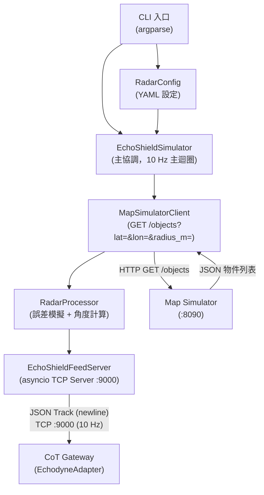

# EchoShield Simulator 規格

---

| 欄位 | 內容 |
|------|------|
| **文件編號** | 04 |
| **版本** | v0.1 |
| **日期** | 2026-04-23 |
| **作者** | 系統架構小組 |
| **狀態** | 草稿 |

---

## 1. 目的與範圍

### 1.1 定位

EchoShield Simulator 是 EchoShield® Multi-Mission 4D Radar（Ku-band 15.4–16.6 GHz）的 PoC 替代品。在 PoC 階段無法取得真實雷達硬體，此模擬器模擬雷達的感測行為並輸出與真實硬體相同格式的資料，讓 CoT Gateway 的 EchodyneAdapter 可無縫切換。

**在完整感測層中的位置**：

```
Map Simulator（:8090）
        │ GET /objects?lat=&lon=&radius_m=4800（HTTP, 10 Hz）
        ↓
EchoShield Simulator
 ├─ 取得無人機精確位置
 ├─ 模擬雷達誤差（位置噪點、速度噪點）
 ├─ 計算方位角（azimuth）與仰角（elevation）
 └─ 輸出 EchoShield JSON TCP Feed（:9000）
        │
        ↓
CoT Gateway（EchodyneAdapter）
```

### 1.2 PoC 限制

- 不模擬真實雷達的電磁特性（RCS、SNR 為固定值）
- 不模擬地形遮蔽或大氣折射效應
- 角度計算使用簡化球面幾何（非完整雷達波束成形演算法）
- 最多支援 20 個並行追蹤目標（PoC 場景最多 5 架）

---

## 2. 功能需求

| ID | 需求描述 | 優先級 |
|----|---------|-------|
| FR-ES-001 | 以 10 Hz（每 100ms）向 Map Simulator 查詢雷達偵測圓心 ± 最大偵測距離（預設 4800m）內的無人機物件 | 必要 |
| FR-ES-002 | 將查詢結果轉換為 EchoShield JSON 格式（track_id, latitude, longitude, altitude_m, velocity_ms, azimuth_deg, elevation_deg, timestamp, track_status, classification）| 必要 |
| FR-ES-003 | 雷達誤差模擬：位置噪點 ±5m（Gaussian noise, σ=5m）、速度噪點 ±0.5 m/s（Gaussian noise, σ=0.5）| 必要 |
| FR-ES-004 | 計算方位角（azimuth_deg）與仰角（elevation_deg）：以雷達安裝位置（lat/lon/alt_m）為參考，計算至目標的 bearing 與垂直角 | 必要 |
| FR-ES-005 | 偵測距離限制：僅回報雷達最大偵測範圍內的目標（Group 1: ≤4.8km、Group 2: ≤6.4km、Group 3: ≤11.4km，由設定檔選擇）| 必要 |
| FR-ES-006 | 以 asyncio TCP Server 提供 EchoShield JSON TCP Feed（Port :9000），支援多個並行 Client 連線（EchodyneAdapter）| 必要 |
| FR-ES-007 | `track_status` 邏輯：目標進入偵測範圍 → `"Active"`；目標離開範圍或 Map Simulator TTL 到期 → `"Lost"`（推送最後一筆 Lost 後移除）| 必要 |
| FR-ES-008 | `classification` 固定回報 `"UAV"`（EchoShield 硬體無型號識別能力）| 必要 |
| FR-ES-009 | 支援多目標同時追蹤（場景二：3 架無人機並行）| 必要 |
| FR-ES-010 | 雷達位置（lat/lon/alt_m）、最大偵測距離、更新頻率、噪點參數均可由 YAML 設定檔配置 | 必要 |
| FR-ES-011 | 提供 CLI 介面，支援 `--config` 參數指定設定檔，以及 `--verbose` 詳細日誌 | 必要 |

---

## 3. 技術架構

### 3.1 概覽

EchoShield Simulator 採用 Python asyncio 實作，包含三個主要元件：

1. **`MapSimulatorClient`**：HTTP Client，以 10 Hz 向 Map Simulator（:8090）查詢偵測範圍內物件
2. **`RadarProcessor`**：對查詢結果加入雷達誤差模擬，計算 azimuth/elevation，轉換為 EchoShield Track 格式
3. **`EchoShieldFeedServer`**：asyncio TCP Server（:9000），廣播 JSON Track 給所有已連線的 EchodyneAdapter

### 3.2 模組結構圖



### 3.3 主要類別

| 類別 | 職責 |
|------|------|
| `RadarConfig` | dataclass，儲存雷達設定參數（位置、偵測距離、更新率、噪點參數）|
| `MapSimulatorClient` | aiohttp HTTP Client，查詢 Map Simulator GET /objects，解析回傳的物件列表 |
| `RadarProcessor` | 將 Map Simulator 物件轉換為 EchoShield Track：加入位置/速度噪點，計算 azimuth/elevation |
| `EchoShieldFeedServer` | asyncio TCP Server（:9000），維護已連線 Client 列表，廣播 JSON Track |
| `EchoShieldSimulator` | 主協調類別，整合以上元件，驅動 10 Hz 主迴圈 |

---

## 4. EchoShield JSON 輸出格式

### 4.1 單筆 Track JSON（換行分隔）

```json
{
  "track_id": "echo-a1b2c3d4",
  "latitude": 24.123456,
  "longitude": 121.234567,
  "altitude_m": 80.5,
  "velocity_ms": 15.2,
  "azimuth_deg": 45.3,
  "elevation_deg": 12.1,
  "timestamp": "2026-04-23T10:00:00.100Z",
  "track_status": "Active",
  "classification": "UAV"
}
```

### 4.2 欄位說明

| 欄位 | 型別 | 說明 |
|------|------|------|
| `track_id` | string | `echo-{uuid4前8位}`，每架無人機固定（進入偵測範圍時分配，離開前不變）|
| `latitude` | float | WGS84 緯度，含位置噪點（σ=5m）|
| `longitude` | float | WGS84 經度，含位置噪點（σ=5m）|
| `altitude_m` | float | 高度（公尺，HAE），含噪點（σ=2m）|
| `velocity_ms` | float | 速度（m/s），含速度噪點（σ=0.5）|
| `azimuth_deg` | float | 方位角（度，正北為 0，順時針）：雷達位置至目標的 bearing |
| `elevation_deg` | float | 仰角（度，水平為 0，正值向上）：雷達至目標的垂直角 |
| `timestamp` | string | ISO 8601 UTC，精確到毫秒（每筆更新時的實際時間）|
| `track_status` | string | `"Active"`（偵測中）/ `"Lost"`（離開範圍，最後一筆）|
| `classification` | string | 固定 `"UAV"` |

### 4.3 廣播時序

- 每 100ms（10 Hz），`EchoShieldFeedServer` 廣播一批 JSON Lines
- 每次廣播：所有 Active 目標各一行 JSON
- 目標從偵測範圍消失時：額外推送一筆 `track_status: "Lost"`，後續不再廣播
- 無目標時：不廣播（安靜模式）

---

## 5. 雷達特性模擬

### 5.1 位置噪點（Gaussian Noise）

```python
import random
import math

def add_position_noise(lat: float, lon: float, alt_m: float,
                        sigma_m: float = 5.0) -> tuple:
    """
    加入高斯位置噪點（sigma_m 公尺）
    """
    # 緯度方向噪點
    delta_lat = random.gauss(0, sigma_m) / 111320.0  # 1度緯度 ≈ 111320m
    # 經度方向噪點（依緯度修正）
    delta_lon = random.gauss(0, sigma_m) / (111320.0 * math.cos(math.radians(lat)))
    # 高度噪點（σ=2m）
    delta_alt = random.gauss(0, 2.0)
    return lat + delta_lat, lon + delta_lon, alt_m + delta_alt
```

### 5.2 方位角（Azimuth）計算

方位角為雷達安裝位置至目標的 bearing（正北為 0°，順時針）：

```python
def calc_azimuth(radar_lat: float, radar_lon: float,
                  target_lat: float, target_lon: float) -> float:
    """
    計算從雷達位置到目標的方位角（度，正北=0，順時針）
    """
    lat1 = math.radians(radar_lat)
    lat2 = math.radians(target_lat)
    dlon = math.radians(target_lon - radar_lon)
    x = math.sin(dlon) * math.cos(lat2)
    y = (math.cos(lat1) * math.sin(lat2)
         - math.sin(lat1) * math.cos(lat2) * math.cos(dlon))
    bearing = math.degrees(math.atan2(x, y))
    return (bearing + 360) % 360
```

### 5.3 仰角（Elevation）計算

仰角為雷達至目標的垂直角（水平=0°，正值向上）：

```python
def calc_elevation(radar_lat: float, radar_lon: float, radar_alt_m: float,
                    target_lat: float, target_lon: float, target_alt_m: float) -> float:
    """
    計算仰角（度，水平=0，向上為正）
    """
    horiz_dist = haversine_distance(radar_lat, radar_lon, target_lat, target_lon)
    alt_diff = target_alt_m - radar_alt_m
    if horiz_dist < 1.0:  # 避免除零
        return 90.0 if alt_diff > 0 else -90.0
    return math.degrees(math.atan2(alt_diff, horiz_dist))
```

### 5.4 偵測距離分組

| 分組 | 最大偵測距離 | 適用情境 |
|------|------------|---------|
| Group 1 | 4,800 m（4.8 km）| 小型無人機（DJI Mavic 3）近距偵測 |
| Group 2 | 6,400 m（6.4 km）| 中型無人機（DJI Matrice 30T）|
| Group 3 | 11,400 m（11.4 km）| 大型目標或長程偵測 |

設定檔中 `max_range_m` 可設為任意值；`MapSimulatorClient` 查詢時以此值為 `radius_m`。

---

## 6. Python 完整類別介面

```python
# echoshield_simulator.py
import asyncio
import json
import math
import random
import uuid
from dataclasses import dataclass, field
from datetime import datetime, timezone
from typing import Dict, List, Optional
import aiohttp


# ─────────────────────────── 資料型別 ───────────────────────────

@dataclass
class RadarConfig:
    """雷達安裝與運行參數"""
    lat: float               # 雷達安裝緯度（WGS84）
    lon: float               # 雷達安裝經度（WGS84）
    alt_m: float             # 雷達安裝高度（公尺）
    max_range_m: float = 4800.0   # 最大偵測距離（公尺）
    update_rate_hz: float = 10.0  # 輸出頻率（Hz）
    position_noise_m: float = 5.0 # 位置噪點（1-sigma, 公尺）
    velocity_noise_ms: float = 0.5 # 速度噪點（1-sigma, m/s）


@dataclass
class EchoShieldTrack:
    """單架無人機的雷達追蹤記錄"""
    track_id: str
    latitude: float
    longitude: float
    altitude_m: float
    velocity_ms: float
    azimuth_deg: float
    elevation_deg: float
    timestamp: str
    track_status: str  # "Active" | "Lost"
    classification: str = "UAV"

    def to_json_line(self) -> str:
        return json.dumps(self.__dict__) + "\n"


# ─────────────────────────── Map Simulator Client ───────────────────────────

class MapSimulatorClient:
    """向 Map Simulator REST API 查詢偵測範圍內物件"""

    def __init__(self, base_url: str = "http://localhost:8090"):
        self.base_url = base_url

    async def query_objects(
        self, lat: float, lon: float, radius_m: float
    ) -> List[dict]:
        """
        GET /objects?lat={lat}&lon={lon}&radius_m={radius_m}
        回傳範圍內所有無人機物件列表
        """
        url = f"{self.base_url}/objects"
        params = {"lat": lat, "lon": lon, "radius_m": radius_m}
        async with aiohttp.ClientSession() as session:
            async with session.get(url, params=params, timeout=aiohttp.ClientTimeout(total=1.0)) as resp:
                if resp.status == 200:
                    data = await resp.json()
                    return data.get("objects", [])
                return []


# ─────────────────────────── Radar Processor ───────────────────────────

class RadarProcessor:
    """將 Map Simulator 物件轉換為 EchoShield Track（含誤差模擬與角度計算）"""

    def __init__(self, config: RadarConfig):
        self.config = config
        self._track_ids: Dict[str, str] = {}  # drone_id → track_id（進入範圍後固定）

    def process(self, obj: dict) -> EchoShieldTrack:
        """
        將單個 Map Simulator 物件轉換為 EchoShieldTrack
        :param obj: {"drone_id", "lat", "lon", "alt_m", "speed_ms", "heading_deg", ...}
        """
        drone_id = obj["drone_id"]

        # 分配固定 track_id
        if drone_id not in self._track_ids:
            self._track_ids[drone_id] = "echo-" + uuid.uuid4().hex[:8]
        track_id = self._track_ids[drone_id]

        # 加入位置噪點
        lat, lon, alt_m = self._add_position_noise(
            obj["lat"], obj["lon"], obj["alt_m"]
        )

        # 加入速度噪點
        velocity_ms = max(
            0.0, obj.get("speed_ms", 0.0) + random.gauss(0, self.config.velocity_noise_ms)
        )

        # 計算方位角與仰角
        azimuth_deg = self._calc_azimuth(lat, lon)
        elevation_deg = self._calc_elevation(lat, lon, alt_m)

        return EchoShieldTrack(
            track_id=track_id,
            latitude=round(lat, 7),
            longitude=round(lon, 7),
            altitude_m=round(alt_m, 1),
            velocity_ms=round(velocity_ms, 2),
            azimuth_deg=round(azimuth_deg, 2),
            elevation_deg=round(elevation_deg, 2),
            timestamp=datetime.now(timezone.utc).strftime("%Y-%m-%dT%H:%M:%S.%f")[:-3] + "Z",
            track_status="Active",
        )

    def make_lost_track(self, drone_id: str, last_track: EchoShieldTrack) -> EchoShieldTrack:
        """目標離開範圍時，建立 Lost 記錄"""
        lost = EchoShieldTrack(**last_track.__dict__)
        lost.track_status = "Lost"
        lost.timestamp = datetime.now(timezone.utc).strftime("%Y-%m-%dT%H:%M:%S.%f")[:-3] + "Z"
        # 清除 track_id 快取，下次重新偵測時分配新 ID
        self._track_ids.pop(drone_id, None)
        return lost

    def _add_position_noise(self, lat: float, lon: float, alt_m: float) -> tuple:
        sigma = self.config.position_noise_m
        delta_lat = random.gauss(0, sigma) / 111320.0
        delta_lon = random.gauss(0, sigma) / (111320.0 * math.cos(math.radians(lat)))
        delta_alt = random.gauss(0, 2.0)
        return lat + delta_lat, lon + delta_lon, alt_m + delta_alt

    def _calc_azimuth(self, target_lat: float, target_lon: float) -> float:
        lat1 = math.radians(self.config.lat)
        lat2 = math.radians(target_lat)
        dlon = math.radians(target_lon - self.config.lon)
        x = math.sin(dlon) * math.cos(lat2)
        y = (math.cos(lat1) * math.sin(lat2)
             - math.sin(lat1) * math.cos(lat2) * math.cos(dlon))
        return (math.degrees(math.atan2(x, y)) + 360) % 360

    def _calc_elevation(self, target_lat: float, target_lon: float, target_alt_m: float) -> float:
        horiz_dist = _haversine(self.config.lat, self.config.lon, target_lat, target_lon)
        alt_diff = target_alt_m - self.config.alt_m
        if horiz_dist < 1.0:
            return 90.0 if alt_diff > 0 else -90.0
        return math.degrees(math.atan2(alt_diff, horiz_dist))


# ─────────────────────────── Feed Server ───────────────────────────

class EchoShieldFeedServer:
    """asyncio TCP Server（:9000），廣播 EchoShield JSON Track 給所有 Client"""

    def __init__(self, host: str = "0.0.0.0", port: int = 9000):
        self.host = host
        self.port = port
        self._clients: List[asyncio.StreamWriter] = []

    async def start(self) -> None:
        server = await asyncio.start_server(self._handle_client, self.host, self.port)
        async with server:
            await server.serve_forever()

    async def _handle_client(
        self, reader: asyncio.StreamReader, writer: asyncio.StreamWriter
    ) -> None:
        peer = writer.get_extra_info("peername")
        self._clients.append(writer)
        try:
            await reader.read()  # 等待 Client 斷線
        finally:
            self._clients.remove(writer)
            writer.close()

    async def broadcast_tracks(self, tracks: List[EchoShieldTrack]) -> None:
        """廣播一批 Track 至所有已連線 Client"""
        if not tracks or not self._clients:
            return
        payload = "".join(t.to_json_line() for t in tracks).encode()
        dead = []
        for writer in list(self._clients):
            try:
                writer.write(payload)
                await writer.drain()
            except Exception:
                dead.append(writer)
        for w in dead:
            self._clients.remove(w)


# ─────────────────────────── Main Simulator ───────────────────────────

class EchoShieldSimulator:
    """EchoShield Simulator 主類別"""

    def __init__(self, config: RadarConfig,
                 map_sim_url: str = "http://localhost:8090",
                 feed_host: str = "0.0.0.0",
                 feed_port: int = 9000):
        self.config = config
        self.client = MapSimulatorClient(map_sim_url)
        self.processor = RadarProcessor(config)
        self.feed_server = EchoShieldFeedServer(feed_host, feed_port)
        self._active_drone_ids: set = set()

    async def _update_loop(self) -> None:
        """10 Hz 主迴圈：查詢 → 處理 → 廣播"""
        interval = 1.0 / self.config.update_rate_hz
        while True:
            try:
                objects = await self.client.query_objects(
                    self.config.lat, self.config.lon, self.config.max_range_m
                )
                current_ids = {o["drone_id"] for o in objects}

                tracks: List[EchoShieldTrack] = []

                # Active 目標
                for obj in objects:
                    track = self.processor.process(obj)
                    tracks.append(track)

                # Lost 目標（上一輪有、這一輪消失）
                lost_ids = self._active_drone_ids - current_ids
                for drone_id in lost_ids:
                    # 以最後已知位置建立 Lost track（簡化：使用 drone_id 作為 track_id 查找）
                    if drone_id in self.processor._track_ids:
                        lost_track = EchoShieldTrack(
                            track_id=self.processor._track_ids[drone_id],
                            latitude=0.0, longitude=0.0, altitude_m=0.0,
                            velocity_ms=0.0, azimuth_deg=0.0, elevation_deg=0.0,
                            timestamp=datetime.now(timezone.utc).strftime(
                                "%Y-%m-%dT%H:%M:%S.%f")[:-3] + "Z",
                            track_status="Lost",
                        )
                        tracks.append(lost_track)
                        self.processor._track_ids.pop(drone_id, None)

                self._active_drone_ids = current_ids

                await self.feed_server.broadcast_tracks(tracks)

            except Exception as e:
                pass  # 連線異常時靜默繼續（下輪重試）

            await asyncio.sleep(interval)

    async def run(self) -> None:
        await asyncio.gather(
            self.feed_server.start(),
            self._update_loop(),
        )


# ─────────────────────────── 工具函式 ───────────────────────────

def _haversine(lat1: float, lon1: float, lat2: float, lon2: float) -> float:
    """Haversine 距離（公尺）"""
    R = 6371000
    phi1, phi2 = math.radians(lat1), math.radians(lat2)
    dphi = math.radians(lat2 - lat1)
    dlambda = math.radians(lon2 - lon1)
    a = math.sin(dphi / 2) ** 2 + math.cos(phi1) * math.cos(phi2) * math.sin(dlambda / 2) ** 2
    return R * 2 * math.atan2(math.sqrt(a), math.sqrt(1 - a))
```

---

## 7. 場景配置（YAML）

### 7.1 設定檔格式

```yaml
# echoshield_config.yaml

radar:
  lat: 24.0000          # 雷達安裝緯度（WGS84）
  lon: 121.0000         # 雷達安裝經度（WGS84）
  alt_m: 10.0           # 雷達安裝高度（公尺）
  max_range_m: 4800     # 最大偵測距離（Group 1: 4800m）
  update_rate_hz: 10    # 更新頻率（Hz）
  position_noise_m: 5.0 # 位置噪點 1-sigma（公尺）
  velocity_noise_ms: 0.5 # 速度噪點 1-sigma（m/s）

map_simulator:
  url: "http://localhost:8090"

feed_server:
  host: "0.0.0.0"
  port: 9000
```

### 7.2 偵測距離分組設定範例

```yaml
# Group 1（PoC 預設，小型無人機）
radar:
  max_range_m: 4800

# Group 2（中型無人機）
radar:
  max_range_m: 6400

# Group 3（大型目標或長程偵測）
radar:
  max_range_m: 11400
```

---

## 8. CLI 介面

```bash
# 基本啟動（使用預設設定檔）
python echoshield_simulator.py --config echoshield_config.yaml

# 詳細日誌輸出
python echoshield_simulator.py --config echoshield_config.yaml --verbose

# 參數說明：
#   --config   設定檔路徑（YAML，必要）
#   --verbose  啟用 DEBUG 層級日誌（選填）
```

啟動後輸出範例：

```
2026-04-23 10:00:00 | INFO  | EchoShieldSimulator | 雷達位置: (24.0000, 121.0000) alt=10.0m
2026-04-23 10:00:00 | INFO  | EchoShieldFeedServer | TCP Feed 已啟動 0.0.0.0:9000
2026-04-23 10:00:00 | INFO  | MapSimulatorClient  | 連接 Map Simulator: http://localhost:8090
2026-04-23 10:00:00.100 | INFO | EchoShieldSimulator | 偵測到 1 個目標，已廣播
2026-04-23 10:00:00.200 | INFO | EchoShieldSimulator | 偵測到 1 個目標，已廣播
...
2026-04-23 10:00:25.100 | INFO | EchoShieldSimulator | TRK-001 離開偵測範圍，發送 Lost
```

---

## 9. 效能特性

| 指標 | 預期值 | 說明 |
|------|-------|------|
| 更新週期 | 100ms | 10 Hz 固定 |
| 每次查詢延遲 | < 5ms | Map Simulator 本機 HTTP（localhost）|
| 雷達處理延遲 | < 1ms | 純 Python 數學運算 |
| TCP Feed 廣播延遲 | < 1ms | asyncio 本機寫入 |
| **端對端（Map Sim → CoT Gateway）** | **< 10ms** | 遠低於 5 秒驗收標準 |

---

## 10. 依賴清單

```
asyncio (stdlib)
aiohttp>=3.9      # Map Simulator HTTP 查詢
PyYAML>=6.0       # 設定檔解析
math (stdlib)     # 角度計算
random (stdlib)   # 噪點模擬
uuid (stdlib)     # Track ID 生成
pytest>=7.0       # 單元測試
pytest-asyncio>=0.23
```

---

## 11. 單元測試需求

| ID | 測試描述 |
|----|---------|
| TR-ES-001 | 正常目標在範圍內：驗證 track_status = "Active"，track_id 固定 |
| TR-ES-002 | 目標離開範圍：驗證發送一筆 track_status = "Lost"，後續不再廣播 |
| TR-ES-003 | 位置噪點：多次呼叫 `_add_position_noise`，驗證偏移量符合 Gaussian 分布（σ≈5m）|
| TR-ES-004 | 方位角計算：已知雷達位置與目標位置，驗證 azimuth_deg 正確（允許 ±0.1° 誤差）|
| TR-ES-005 | 仰角計算：目標在雷達正上方時 elevation=90°，同一高度時 elevation≈0° |
| TR-ES-006 | 偵測距離限制：距離 > max_range_m 的物件不回傳（由 Map Simulator 過濾，本模組測試連線正確性）|
| TR-ES-007 | 多目標追蹤：3 架無人機同時追蹤，驗證各自 track_id 獨立 |
| TR-ES-008 | TCP Feed 廣播：連線後驗證收到正確格式的 JSON Line |
| TR-ES-009 | YAML 設定檔載入：驗證 RadarConfig 欄位正確解析 |
