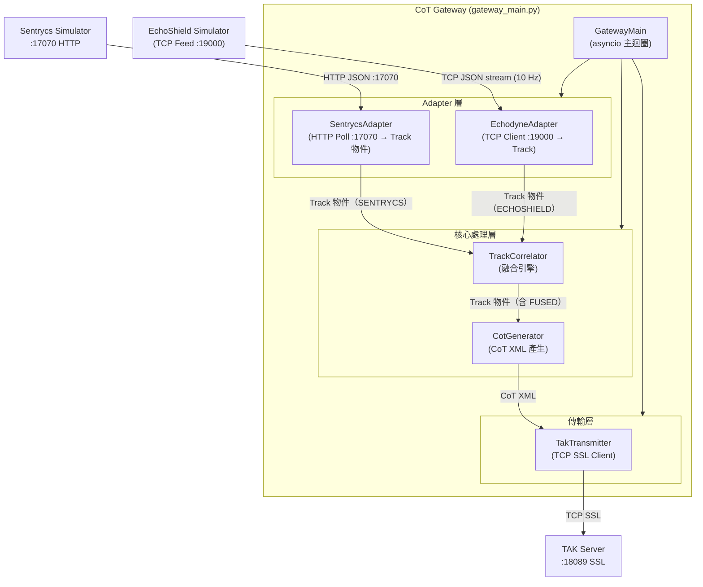

# CoT Gateway 規格

---

| 欄位 | 內容 |
|------|------|
| **文件編號** | 06 |
| **版本** | v0.5 |
| **日期** | 2026-04-23 |
| **作者** | 系統架構小組 |
| **狀態** | 草稿 |

---

## 1. 目的與範圍

CoT Gateway 是本系統的指管層核心，負責：

1. **接收** EchoShield 雷達的 TCP JSON 資料流（透過 EchodyneAdapter）並輪詢 Sentrycs Simulator HTTP :17070（透過 SentrycsAdapter）
2. **轉換** 為統一的 Track 物件
3. **關聯** 雷達航跡與 RF 航跡（TrackCorrelator）
4. **生成** 符合 MIL-STD-2525C 的 CoT XML（CotGenerator）
5. **推送** CoT XML 至 TAK Server（TakTransmitter）

**不在範圍內**：真實 EchoShield 硬體整合（PoC 使用統一無人機模擬器替代）。

---

## 2. 架構概覽

### 2.1 模組圖



### 2.2 主迴圈說明

GatewayMain 使用 asyncio 事件迴圈，各模組以獨立 coroutine 並行運行：

- **EchodyneAdapter coroutine**：持續讀取 EchoShield Simulator TCP JSON 資料流（:19000），非同步放入 Queue；PoC 與生產模式連線目標不同，格式完全相同
- **SentrycsAdapter coroutine**：以 1 Hz 輪詢 Sentrycs Simulator HTTP :17070（GET /detections），解析 JSON，轉換為 Track（source=SENTRYCS），放入同一 Queue
- **TrackCorrelator TTL task**：每秒執行一次，清除過期航跡
- **TakTransmitter send loop**：消費 CoT Queue，非同步發送至 TAK Server
- **Graceful shutdown**：收到 SIGINT/SIGTERM 後優雅關閉所有 coroutine

---

## 3. 統一 Track 物件 Schema

```python
from dataclasses import dataclass, field
from enum import Enum
from typing import Optional
from datetime import datetime

class TrackSource(Enum):
    ECHOSHIELD = "ECHOSHIELD"
    SENTRYCS = "SENTRYCS"
    FUSED = "FUSED"

class TrackStatus(Enum):
    NEW = "NEW"
    UPDATED = "UPDATED"
    LOST = "LOST"

@dataclass
class Track:
    """系統統一航跡物件，在各模組間傳遞"""

    # 識別欄位
    track_id: str               # 全域唯一 ID（如 TRK-001 或 FUSED-001）
    source: TrackSource         # 資料來源

    # 位置欄位（雷達優先，若有 FUSED）
    lat: float                  # WGS84 緯度
    lon: float                  # WGS84 經度
    alt_m: float                # 高度（公尺，HAE）

    # 運動欄位
    velocity_ms: float          # 速度（m/s）
    azimuth_deg: float          # 方位角（度，正北為 0）
    elevation_deg: float        # 仰角（度）

    # 時間欄位
    timestamp: datetime         # 感測器量測時間（UTC）

    # 狀態欄位
    track_status: TrackStatus   # NEW / UPDATED / LOST
    classification: str         # DRONE / BIRD / UNKNOWN

    # 選填欄位（來自 Sentrycs 或融合後）
    drone_model: Optional[str] = None      # 無人機型號（來自 Sentrycs RF 識別）
    detection_status: Optional[str] = None # Sentrycs 狀態（DETECTED/MITIGATING/NEUTRALIZED）

    # 關聯欄位
    correlation_id: Optional[str] = None  # 融合後的關聯 ID
    radar_track_id: Optional[str] = None  # 對應的雷達 track_id
    rf_track_id: Optional[str] = None     # 對應的 RF track_id

    # 操控者位置（來自 Sentrycs）
    operator_lat: Optional[float] = None   # 操控者估計緯度（WGS84）
    operator_lon: Optional[float] = None   # 操控者估計經度（WGS84）

    # 元資料
    received_at: datetime = field(default_factory=datetime.utcnow)  # Gateway 收到的時間
    last_updated: datetime = field(default_factory=datetime.utcnow) # 最後更新時間
```

---

## 4. EchodyneAdapter 規格

### 4.1 職責

接收 EchoShield TCP JSON 資料流，解析並驗證每筆 JSON，轉換為統一 `Track` 物件，並放入內部 Queue 供 TrackCorrelator 消費。

### 4.2 完整 class 介面

```python
import asyncio
import json
from typing import Optional, Callable, Awaitable
from datetime import datetime

class EchodyneAdapter:
    """EchoShield TCP JSON API 接收器與轉換器"""

    def __init__(
        self,
        host: str,
        port: int,
        track_queue: asyncio.Queue,
        reconnect_interval_s: float = 5.0,
        verbose: bool = False
    ) -> None:
        """
        :param host: Unified Drone Simulator / 真實 EchoShield 設備 IP
        :param port: TCP Port（模擬器預設 9000）
        :param track_queue: 解析後的 Track 物件放入此 Queue
        :param reconnect_interval_s: 連線失敗後的重連間隔（秒）
        :param verbose: 是否啟用詳細日誌
        """
        self.host = host
        self.port = port
        self.track_queue = track_queue
        self.reconnect_interval_s = reconnect_interval_s
        self.verbose = verbose
        self._running = False
        self._reader: Optional[asyncio.StreamReader] = None
        self._writer: Optional[asyncio.StreamWriter] = None

    async def start(self) -> None:
        """啟動接收迴圈（會一直運行，自動重連）"""
        self._running = True
        while self._running:
            try:
                await self._connect()
                await self._receive_loop()
            except (ConnectionRefusedError, OSError) as e:
                logger.warning(f"EchodyneAdapter: connection lost: {e}")
                await asyncio.sleep(self.reconnect_interval_s)

    async def stop(self) -> None:
        """停止接收迴圈"""
        self._running = False
        if self._writer:
            self._writer.close()
            await self._writer.wait_closed()

    async def _connect(self) -> None:
        """建立 TCP 連線"""
        self._reader, self._writer = await asyncio.open_connection(self.host, self.port)
        logger.info(f"EchodyneAdapter: connected to {self.host}:{self.port}")

    async def _receive_loop(self) -> None:
        """持續讀取 TCP stream，以換行符分割 JSON"""
        async for line in self._reader:
            if not self._running:
                break
            line = line.decode("utf-8").strip()
            if not line:
                continue
            track = self._parse_json_to_track(line)
            if track:
                await self.track_queue.put(track)

    def _parse_json_to_track(self, json_str: str) -> Optional[Track]:
        """
        解析 JSON 字串為 Track 物件
        :param json_str: 換行分隔的 JSON 字串
        :return: Track 物件，解析失敗回傳 None
        """
        try:
            data = json.loads(json_str)
            self._validate_json(data)
            return Track(
                track_id=data["track_id"],
                source=TrackSource.ECHOSHIELD,
                lat=data["lat"],
                lon=data["lon"],
                alt_m=data["altitude_m"],
                velocity_ms=data["velocity_ms"],
                azimuth_deg=data["azimuth_deg"],
                elevation_deg=data["elevation_deg"],
                timestamp=datetime.fromisoformat(data["timestamp"].replace("Z", "+00:00")),
                track_status=TrackStatus[data["track_status"]],
                classification=data["classification"],
            )
        except (json.JSONDecodeError, KeyError, ValueError) as e:
            logger.error(f"EchodyneAdapter: parse error: {e} | raw: {json_str[:100]}")
            return None

    def _validate_json(self, data: dict) -> None:
        """驗證必填欄位存在且值合法"""
        required = ["track_id","lat","lon","altitude_m","velocity_ms",
                    "azimuth_deg","elevation_deg","timestamp","track_status","classification"]
        for field_name in required:
            if field_name not in data:
                raise ValueError(f"Missing required field: {field_name}")
        if not (-90 <= data["lat"] <= 90):
            raise ValueError(f"Invalid lat: {data['lat']}")
        if not (-180 <= data["lon"] <= 180):
            raise ValueError(f"Invalid lon: {data['lon']}")
        if data["track_status"] not in ("NEW", "UPDATED", "LOST"):
            raise ValueError(f"Invalid track_status: {data['track_status']}")
```

### 4.3 錯誤處理

| 錯誤類型 | 處理方式 |
|---------|---------|
| 連線失敗（ConnectionRefusedError）| 等待 `reconnect_interval_s` 後重試 |
| JSON 格式錯誤（json.JSONDecodeError）| 記錄 ERROR 日誌，跳過該筆資料 |
| 缺少必填欄位（KeyError）| 記錄 ERROR 日誌，跳過該筆資料 |
| 值超出範圍（ValueError）| 記錄 WARNING 日誌，跳過該筆資料 |
| TCP 連線中斷（EOF）| 觸發重連機制 |

---

## 5. EchodyneAdapter 雙模式設計（PoC / 生產）

EchodyneAdapter 同時支援 PoC 模式（連接 EchoShield Simulator）與生產模式（連接真實 EchoShield 硬體），無需切換 Adapter 類別，僅需在設定檔中修改 `host` 與 `port`：

| 模式 | 連線目標 | Host | Port | 加密 |
|------|---------|------|------|------|
| PoC | EchoShield Simulator（本機）| `127.0.0.1` | 9000 | 無（本機通訊）|
| 生產 | 真實 EchoShield 硬體 | 雷達設備 IP | 依硬體規格 | 依硬體設定 |

兩種模式輸出格式完全相同（EchoShield JSON TCP Feed），EchodyneAdapter 無需任何代碼修改。

```yaml
# PoC 模式（EchoShield Simulator）
gateway:
  echoshield:
    host: "127.0.0.1"
    port: 9000
    reconnect_interval_s: 5

# 生產模式（真實 EchoShield 硬體）
gateway:
  echoshield:
    host: "192.168.1.50"   # 雷達設備 LAN IP
    port: 9000              # 依 EchoShield 硬體規格
    reconnect_interval_s: 5
```

---

---

## 6. TrackCorrelator 規格（最詳細）

### 6.1 職責

- 維護三個字典：`radar_tracks`（EchoShield）、`rf_tracks`（Sentrycs，來自 SentrycsAdapter）、`fused_tracks`
- 統一接收來自 `EchodyneAdapter` 和 `SentrycsAdapter` 的 Track 物件（透過同一 `track_queue`，由 source 欄位區分）
- 每次收到新的 EchoShield Track 時，嘗試與現有 RF Tracks（source=SENTRYCS）關聯
- 若關聯成功，建立 FUSED Track（雷達提供位置/速度，RF 提供型號/分類）
- 每秒執行 TTL 清理，超過 10s 未更新的航跡標記為 LOST

### 6.2 Haversine 距離公式（完整實作）

```python
import math
from typing import Tuple

def haversine_distance(lat1: float, lon1: float, lat2: float, lon2: float) -> float:
    """
    計算兩個 WGS84 座標點之間的球面距離（公尺）
    :param lat1: 點一緯度（度）
    :param lon1: 點一經度（度）
    :param lat2: 點二緯度（度）
    :param lon2: 點二經度（度）
    :return: 距離（公尺）
    """
    R = 6371000  # 地球平均半徑（公尺）
    phi1 = math.radians(lat1)
    phi2 = math.radians(lat2)
    dphi = math.radians(lat2 - lat1)
    dlambda = math.radians(lon2 - lon1)
    a = (math.sin(dphi / 2) ** 2
         + math.cos(phi1) * math.cos(phi2) * math.sin(dlambda / 2) ** 2)
    c = 2 * math.atan2(math.sqrt(a), math.sqrt(1 - a))
    return R * c
```

### 6.3 關聯演算法

```
關聯演算法（每次收到 EchoShield Track 時執行）：

1. 接收新的 radar Track（source=ECHOSHIELD）
2. 更新 radar_tracks[track.track_id] = track
3. 初始化 best_match = None, min_dist = ∞
4. 對每個 rf_track in rf_tracks.values():
   a. 計算 Haversine 距離 dist = haversine(radar.lat, radar.lon, rf.lat, rf.lon)
   b. 計算時間差 time_diff = abs(radar.timestamp - rf.timestamp).seconds
   c. 若 dist ≤ 50m AND time_diff ≤ 3s AND dist < min_dist:
      best_match = rf_track
      min_dist = dist
5. 若 best_match 存在：
   a. 建立 FUSED Track：
      - lat, lon, alt_m, velocity_ms, azimuth_deg = radar 的值（位置優先）
      - classification, drone_model, detection_status = rf 的值（型號優先）
      - source = FUSED
      - radar_track_id = radar.track_id
      - rf_track_id = rf.track_id
      - correlation_id = f"FUSED-{radar.track_id}"
   b. 更新 fused_tracks[correlation_id] = fused_track
   c. 回傳 fused_track
6. 若無 best_match：
   a. 回傳原始 radar Track（未關聯）
```

### 6.4 完整 class 介面

```python
import asyncio
from typing import Dict, Optional, List
from datetime import datetime, timezone

class TrackCorrelator:
    """雷達與 RF 航跡關聯融合引擎"""

    def __init__(
        self,
        distance_threshold_m: float = 50.0,
        time_window_s: float = 3.0,
        ttl_s: float = 10.0
    ) -> None:
        """
        :param distance_threshold_m: 關聯距離閾值（公尺）
        :param time_window_s: 關聯時間視窗（秒）
        :param ttl_s: 航跡存活時間（秒）
        """
        self.distance_threshold_m = distance_threshold_m
        self.time_window_s = time_window_s
        self.ttl_s = ttl_s

        # 三個核心字典（key = track_id）
        self.radar_tracks: Dict[str, Track] = {}
        self.rf_tracks: Dict[str, Track] = {}
        self.fused_tracks: Dict[str, Track] = {}

    def correlate(self, radar_track: Track) -> Track:
        """
        關聯並融合新的雷達航跡
        :param radar_track: 來自 EchodyneAdapter 的雷達 Track
        :return: FUSED Track（若關聯成功）或原始 radar Track
        """
        self.radar_tracks[radar_track.track_id] = radar_track
        best_match = self._find_best_rf_match(radar_track)

        if best_match:
            return self._create_fused_track(radar_track, best_match)
        return radar_track

    def add_rf_track(self, rf_track: Track) -> None:
        """
        加入 RF 航跡（來自 Sentrycs，若接 Gateway 時使用）
        :param rf_track: 來自 RF 感測器的 Track
        """
        self.rf_tracks[rf_track.track_id] = rf_track

    def update_ttl(self) -> List[Track]:
        """
        更新 TTL，標記過期航跡為 LOST
        每秒呼叫一次
        :return: 被標記為 LOST 的 Track 清單
        """
        now = datetime.now(timezone.utc)
        lost_tracks = []

        for track_id, track in list(self.radar_tracks.items()):
            age = (now - track.last_updated).total_seconds()
            if age > self.ttl_s and track.track_status != TrackStatus.LOST:
                track.track_status = TrackStatus.LOST
                lost_tracks.append(track)

        return lost_tracks

    def get_all_active_tracks(self) -> List[Track]:
        """
        取得所有活躍航跡（用於定期全量推送）
        優先回傳 FUSED，再回傳未關聯的 ECHOSHIELD
        :return: 活躍 Track 清單
        """
        result = []
        fused_radar_ids = {t.radar_track_id for t in self.fused_tracks.values()}

        for track in self.fused_tracks.values():
            if track.track_status != TrackStatus.LOST:
                result.append(track)

        for track_id, track in self.radar_tracks.items():
            if track_id not in fused_radar_ids and track.track_status != TrackStatus.LOST:
                result.append(track)

        return result

    def _find_best_rf_match(self, radar: Track) -> Optional[Track]:
        """尋找最近的 RF Track（符合距離與時間條件）"""
        best_match = None
        min_dist = float("inf")

        for rf_track in self.rf_tracks.values():
            if rf_track.track_status == TrackStatus.LOST:
                continue
            dist = haversine_distance(radar.lat, radar.lon, rf_track.lat, rf_track.lon)
            time_diff = abs((radar.timestamp - rf_track.timestamp).total_seconds())
            if dist <= self.distance_threshold_m and time_diff <= self.time_window_s:
                if dist < min_dist:
                    min_dist = dist
                    best_match = rf_track

        return best_match

    def _create_fused_track(self, radar: Track, rf: Track) -> Track:
        """建立融合航跡：雷達提供位置，RF 提供型號"""
        return Track(
            track_id=f"FUSED-{radar.track_id}",
            source=TrackSource.FUSED,
            lat=radar.lat,              # 雷達位置優先
            lon=radar.lon,
            alt_m=radar.alt_m,
            velocity_ms=radar.velocity_ms,
            azimuth_deg=radar.azimuth_deg,
            elevation_deg=radar.elevation_deg,
            timestamp=radar.timestamp,
            track_status=radar.track_status,
            classification=rf.classification,   # RF 分類優先
            drone_model=rf.drone_model,         # RF 型號優先
            detection_status=rf.detection_status,
            correlation_id=f"FUSED-{radar.track_id}",
            radar_track_id=radar.track_id,
            rf_track_id=rf.track_id,
        )
```

---

## 7. CotGenerator 規格

### 7.1 Track → CoT Type 映射表

| Track.source | Track.detection_status | CoT Type | 說明 |
|-------------|----------------------|---------|------|
| `ECHOSHIELD` | None | `a-u-A-M-F-Q-r` | 雷達偵測未識別，灰色 |
| `FUSED` | None | `a-h-A-M-F-Q-r` | 融合航跡（有型號），紅色 |
| `FUSED` | DETECTED | `a-h-A-M-F-Q-r` | 融合且 Sentrycs 確認，紅色 |
| `FUSED` | MITIGATING | `a-h-A-M-F-Q-r` | RF 干擾中，橘色閃爍 |
| `FUSED` | NEUTRALIZED | `a-h-A-M-F-Q-r` | 已被制壓，藍色 |

### 7.2 stale time 計算規則

```python
from datetime import datetime, timedelta, timezone

def calculate_stale(now: datetime, detection_status: Optional[str] = None) -> datetime:
    """
    計算 CoT stale time
    - 正常情況：now + 15s
    - NEUTRALIZED：now + 30s（保持顯示更長時間）
    """
    if detection_status == "NEUTRALIZED":
        return now + timedelta(seconds=30)
    return now + timedelta(seconds=15)
```

### 7.3 uid 生成規則

| Track.source | uid 格式 | 範例 |
|-------------|---------|------|
| `ECHOSHIELD` | `ECHOSHIELD-{track_id}` | `ECHOSHIELD-TRK-001` |
| `FUSED` | `FUSED-{radar_track_id}` | `FUSED-TRK-001` |
| `SENTRYCS` | `SENTRYCS-{model}-{seq}` | `SENTRYCS-DJI-Mavic3-001` |

### 7.4 完整 class 介面

```python
from datetime import datetime, timedelta, timezone
from typing import Optional

class CotGenerator:
    """CoT XML 生成器（MIL-STD-2525C）"""

    def generate(self, track: Track) -> str:
        """
        從 Track 物件生成 CoT XML 字串
        :param track: 統一 Track 物件
        :return: CoT XML 字串
        """
        now = datetime.now(timezone.utc)
        uid = self._get_uid(track)
        cot_type = self._get_cot_type(track)
        stale = calculate_stale(now, track.detection_status)
        time_str = now.strftime("%Y-%m-%dT%H:%M:%S.000Z")
        stale_str = stale.strftime("%Y-%m-%dT%H:%M:%S.000Z")
        remarks = self._get_remarks(track)

        return f"""<?xml version="1.0" encoding="UTF-8"?>
<event version="2.0"
       uid="{uid}"
       type="{cot_type}"
       time="{time_str}"
       start="{time_str}"
       stale="{stale_str}"
       how="m-g">
  <point lat="{track.lat:.7f}" lon="{track.lon:.7f}" hae="{track.alt_m:.1f}" ce="10.0" le="5.0"/>
  <detail>
    <contact callsign="{uid}"/>
    <remarks>{remarks}</remarks>
    <track speed="{track.velocity_ms:.2f}" course="{track.azimuth_deg:.2f}"/>
  </detail>
</event>"""

    def _get_uid(self, track: Track) -> str:
        if track.source == TrackSource.ECHOSHIELD:
            return f"ECHOSHIELD-{track.track_id}"
        elif track.source == TrackSource.FUSED:
            return f"FUSED-{track.radar_track_id}"
        return track.track_id

    def _get_cot_type(self, track: Track) -> str:
        if track.source == TrackSource.ECHOSHIELD:
            return "a-u-A-M-F-Q-r"
        return "a-h-A-M-F-Q-r"

    def _get_remarks(self, track: Track) -> str:
        parts = [f"Source: {track.source.value}"]
        if track.drone_model:
            parts.append(f"Model: {track.drone_model}")
        if track.detection_status:
            parts.append(f"Status: {track.detection_status}")
        parts.append(f"Speed: {track.velocity_ms:.1f}m/s")
        parts.append(f"Alt: {track.alt_m:.0f}m")
        return " | ".join(parts)
```

---

## 8. TakTransmitter 規格

### 8.1 完整 class 介面

```python
import asyncio
import ssl
from typing import Optional

class TakTransmitter:
    """TAK Server TCP SSL CoT 發送器"""

    def __init__(
        self,
        host: str,
        port: int,
        use_ssl: bool = True,
        cert_file: Optional[str] = None,
        cert_password: Optional[str] = None,
        max_retries: int = 5
    ) -> None:
        self.host = host
        self.port = port
        self.use_ssl = use_ssl
        self.cert_file = cert_file
        self.cert_password = cert_password
        self.max_retries = max_retries
        self._writer: Optional[asyncio.StreamWriter] = None
        self._reader: Optional[asyncio.StreamReader] = None
        self._cot_queue: asyncio.Queue = asyncio.Queue(maxsize=500)

    async def start(self) -> None:
        """啟動發送迴圈（連線 + 消費 Queue）"""
        await self._connect_with_retry()
        asyncio.create_task(self._send_loop())

    async def stop(self) -> None:
        """優雅關閉"""
        if self._writer:
            self._writer.close()
            await self._writer.wait_closed()

    async def enqueue_cot(self, cot_xml: str) -> None:
        """將 CoT XML 加入發送 Queue（非阻塞）"""
        try:
            self._cot_queue.put_nowait(cot_xml)
        except asyncio.QueueFull:
            logger.warning("TakTransmitter: CoT queue full, dropping message")

    async def _send_loop(self) -> None:
        """持續消費 Queue 並發送"""
        while True:
            cot_xml = await self._cot_queue.get()
            await self._send(cot_xml)
            self._cot_queue.task_done()

    async def _send(self, cot_xml: str) -> None:
        """發送單筆 CoT XML（換行分隔）"""
        try:
            data = (cot_xml + "\n").encode("utf-8")
            self._writer.write(data)
            await self._writer.drain()
        except (ConnectionResetError, BrokenPipeError, OSError) as e:
            logger.error(f"TakTransmitter: send failed: {e}")
            await self._connect_with_retry()
            # 重連成功後重試
            data = (cot_xml + "\n").encode("utf-8")
            self._writer.write(data)
            await self._writer.drain()

    async def _connect_with_retry(self) -> None:
        """指數退避重連（最多 max_retries 次）"""
        backoff = 1.0
        for attempt in range(1, self.max_retries + 1):
            try:
                ssl_ctx = self._create_ssl_context() if self.use_ssl else None
                self._reader, self._writer = await asyncio.open_connection(
                    self.host, self.port, ssl=ssl_ctx
                )
                logger.info(f"TakTransmitter: connected to {self.host}:{self.port}")
                return
            except Exception as e:
                logger.warning(f"TakTransmitter: connect attempt {attempt} failed: {e}")
                if attempt < self.max_retries:
                    await asyncio.sleep(backoff)
                    backoff = min(backoff * 2, 60.0)
        raise ConnectionError(f"TakTransmitter: failed after {self.max_retries} attempts")

    def _create_ssl_context(self) -> ssl.SSLContext:
        """建立 SSL Context"""
        ctx = ssl.SSLContext(ssl.PROTOCOL_TLS_CLIENT)
        ctx.load_cert_chain(certfile=self.cert_file, password=self.cert_password)
        ctx.check_hostname = False
        ctx.verify_mode = ssl.CERT_NONE  # PoC 模式暫時停用憑證驗證
        return ctx
```

---

## 9. GatewayMain 規格

### 9.1 主程式骨架

```python
#!/usr/bin/env python3
"""CoT Gateway 主程式進入點"""

import asyncio
import signal
import sys
import yaml
import logging
from pathlib import Path

logger = logging.getLogger(__name__)

class GatewayMain:
    """CoT Gateway 主協調器"""

    def __init__(self, config_file: str) -> None:
        self.config = self._load_config(config_file)
        self.track_queue: asyncio.Queue = asyncio.Queue(maxsize=1000)
        self.cot_queue: asyncio.Queue = asyncio.Queue(maxsize=1000)
        self._running = False

        # 模組初始化
        self.adapter = EchodyneAdapter(
            host=self.config["gateway"]["echoshield"]["host"],
            port=self.config["gateway"]["echoshield"]["port"],
            track_queue=self.track_queue,
        )
        self.sentrycs_adapter = SentrycsAdapter(
            host=self.config["gateway"]["sentrycs"]["host"],
            port=self.config["gateway"]["sentrycs"]["port"],
            track_queue=self.track_queue,
            poll_interval_s=self.config["gateway"]["sentrycs"]["poll_interval_s"],
        )
        self.correlator = TrackCorrelator(
            distance_threshold_m=self.config["gateway"]["correlator"]["distance_threshold_m"],
            time_window_s=self.config["gateway"]["correlator"]["time_window_s"],
            ttl_s=self.config["gateway"]["correlator"]["ttl_s"],
        )
        self.cot_gen = CotGenerator()
        self.transmitter = TakTransmitter(
            host=self.config["gateway"]["tak_server"]["host"],
            port=self.config["gateway"]["tak_server"]["port"],
            use_ssl=self.config["gateway"]["tak_server"]["use_ssl"],
            cert_file=self.config["gateway"]["tak_server"].get("cert_file"),
            cert_password=self.config["gateway"]["tak_server"].get("cert_password"),
        )

    async def run(self) -> None:
        """啟動所有模組，進入主迴圈"""
        self._running = True
        logger.info("CoT Gateway starting...")

        await self.transmitter.start()

        tasks = [
            asyncio.create_task(self.adapter.start(), name="adapter"),
            asyncio.create_task(self.sentrycs_adapter.start(), name="sentrycs_adapter"),
            asyncio.create_task(self._processing_loop(), name="processing"),
            asyncio.create_task(self._ttl_loop(), name="ttl"),
        ]

        try:
            await asyncio.gather(*tasks)
        except asyncio.CancelledError:
            logger.info("CoT Gateway shutting down...")
        finally:
            await self._cleanup(tasks)

    async def _processing_loop(self) -> None:
        """消費 Track Queue，執行關聯與 CoT 生成"""
        while self._running:
            track = await self.track_queue.get()
            fused_or_raw = self.correlator.correlate(track)
            cot_xml = self.cot_gen.generate(fused_or_raw)
            await self.transmitter.enqueue_cot(cot_xml)
            self.track_queue.task_done()

    async def _ttl_loop(self) -> None:
        """每秒執行 TTL 清理，推送 LOST CoT"""
        while self._running:
            await asyncio.sleep(1.0)
            lost_tracks = self.correlator.update_ttl()
            for lost in lost_tracks:
                cot_xml = self.cot_gen.generate(lost)
                await self.transmitter.enqueue_cot(cot_xml)

    async def _cleanup(self, tasks: list) -> None:
        """優雅關閉所有 tasks"""
        for task in tasks:
            task.cancel()
        await asyncio.gather(*tasks, return_exceptions=True)
        await self.adapter.stop()
        await self.transmitter.stop()

    @staticmethod
    def _load_config(config_file: str) -> dict:
        with open(config_file, "r", encoding="utf-8") as f:
            return yaml.safe_load(f)


def main():
    import argparse
    parser = argparse.ArgumentParser(description="CoT Gateway")
    parser.add_argument("--config", default="config/gateway.yaml")
    args = parser.parse_args()

    gateway = GatewayMain(config_file=args.config)

    loop = asyncio.new_event_loop()

    def _shutdown():
        gateway._running = False
        for task in asyncio.all_tasks(loop):
            task.cancel()

    loop.add_signal_handler(signal.SIGINT, _shutdown)
    loop.add_signal_handler(signal.SIGTERM, _shutdown)

    try:
        loop.run_until_complete(gateway.run())
    finally:
        loop.close()
        sys.exit(0)

if __name__ == "__main__":
    main()
```

---

## 10. 設定檔格式（完整 YAML）

```yaml
# config/gateway.yaml

gateway:
  echoshield:
    host: "127.0.0.1"
    port: 9000
    reconnect_interval_s: 5
  sentrycs:
    host: "localhost"
    port: 7070
    reconnect_interval_s: 5
    enabled: true

  correlator:
    distance_threshold_m: 50       # 關聯距離閾值（公尺）
    time_window_s: 3               # 關聯時間視窗（秒）
    ttl_s: 10                      # 航跡存活時間（秒）

  tak_server:
    host: "localhost"  # 展示主機本機 TAK Server（Docker）
    port: 8089
    use_ssl: true
    cert_file: "certs/gateway.p12"
    cert_password: "atakatak"
    max_retries: 5                 # 連線失敗最大重試次數

  logging:
    level: INFO                    # DEBUG / INFO / WARNING / ERROR
    file: "logs/gateway.log"       # 留空則只輸出到 stdout
    max_bytes: 10485760            # 10MB
    backup_count: 5
```

---

## 11. 錯誤處理策略

| 錯誤類型 | 發生位置 | 處理方式 | 重試策略 |
|---------|---------|---------|---------|
| EchoShield TCP 連線失敗 | EchodyneAdapter | 記錄 WARNING，等待後重連 | 固定間隔 5s，無限重試 |
| JSON 解析失敗 | EchodyneAdapter | 記錄 ERROR，跳過該筆資料 | 不重試（資料已損壞）|
| 欄位值超出範圍 | EchodyneAdapter | 記錄 WARNING，跳過該筆資料 | 不重試 |
| TAK Server TCP 連線失敗 | TakTransmitter | 指數退避重連 | 指數退避（1s→2s→4s→…60s），最多 5 次 |
| CoT Queue 滿（500 筆）| TakTransmitter | 記錄 WARNING，丟棄最新訊息 | 不重試（系統過載，優先保護 TAK Server）|
| Track Queue 滿（1000 筆）| GatewayMain | 記錄 ERROR，考慮告警 | 不重試 |
| SIGINT / SIGTERM | GatewayMain | 優雅關閉所有 task，等待 Queue 清空 | 不適用 |

---

## 12. 日誌規格

### 12.1 日誌格式

```
%(asctime)s | %(levelname)-8s | %(name)-20s | %(message)s

範例：
2025-07-10 08:00:01.234 | INFO     | EchodyneAdapter     | Connected to 127.0.0.1:19000
2025-07-10 08:00:01.334 | DEBUG    | EchodyneAdapter     | Received track: TRK-001 at (25.0330, 121.5654)
2025-07-10 08:00:01.340 | INFO     | TrackCorrelator     | Fused track: FUSED-TRK-001 (radar=TRK-001, rf=RF-001, dist=23.5m)
2025-07-10 08:00:01.342 | DEBUG    | CotGenerator        | Generated CoT for FUSED-TRK-001 (type=a-h-A-M-F-Q-r)
2025-07-10 08:00:01.350 | INFO     | TakTransmitter      | CoT sent: FUSED-TRK-001 (queue_size=0)
```

### 12.2 關鍵事件清單

| 事件 | 日誌等級 | 訊息 |
|------|---------|------|
| EchodyneAdapter 連線成功 | INFO | `Connected to {host}:{port}` |
| EchodyneAdapter 連線失敗 | WARNING | `Connection failed: {error}` |
| Track 解析失敗 | ERROR | `Parse error: {error} | raw: {json[:100]}` |
| 航跡關聯成功 | INFO | `Fused track: {fused_id} (dist={dist:.1f}m)` |
| 航跡 TTL 到期 | INFO | `Track TTL expired: {track_id}` |
| TakTransmitter 連線成功 | INFO | `Connected to TAK Server {host}:{port}` |
| TakTransmitter 重連 | WARNING | `Reconnecting (attempt {n}/{max})` |
| CoT Queue 滿 | WARNING | `CoT queue full, dropping message` |

---

## 13. 效能要求

| 指標 | 目標 | 量測方法 |
|------|------|---------|
| 單筆 Track 處理延遲（Adapter→TakTransmitter）| < 50ms | 日誌時間戳差值 |
| TrackCorrelator 關聯計算時間（5 航跡）| < 1ms | Python time.perf_counter |
| CotGenerator XML 生成時間 | < 5ms | Python time.perf_counter |
| TakTransmitter 發送延遲（本地→本機 TAK Server）| < 10ms | CoT timestamp 與 TAK Server 收到時間差（本機 Docker）|
| Track Queue 最大等待時間 | < 100ms（正常負載）| Queue.qsize() 監控 |
| 吞吐量（最大 msg/s）| > 100 msg/s | 壓力測試（EchoShield Sim 以 20Hz × 5 架）|

---

## 14. 依賴清單

```
# requirements.txt
asyncio             # stdlib（Python 3.11+）
aiofiles>=23.0      # 非同步檔案 I/O（日誌 rotate 用）
aiohttp>=3.9        # HTTP polling client for SentrycsAdapter (GET /detections at 1 Hz)
PyYAML>=6.0         # 設定檔解析
geopy>=2.3          # Haversine 計算輔助
structlog>=23.0     # 結構化日誌
pytest>=7.0         # 單元測試框架
pytest-asyncio>=0.21 # asyncio 測試支援
```

### 專案目錄結構

```
cot_gateway/
├── gateway_main.py              # CLI 入口與 GatewayMain
├── adapters/
│   ├── __init__.py
│   ├── echoshield_adapter.py    # EchodyneAdapter（PoC + 生產雙模式）
│   └── sentrycs_adapter.py      # SentrycsAdapter
├── core/
│   ├── __init__.py
│   ├── track.py                 # Track dataclass, TrackSource, TrackStatus
│   ├── track_correlator.py      # TrackCorrelator, haversine_distance
│   └── cot_generator.py         # CotGenerator
├── transmit/
│   ├── __init__.py
│   └── tak_transmitter.py       # TakTransmitter
├── config/
│   └── gateway.yaml             # 設定檔範本
├── certs/
│   ├── gateway.p12              # TAK Server 客戶端憑證
│   └── truststore.pem           # TAK-POC-CA 根憑證
├── logs/                        # 日誌輸出目錄
├── tests/
│   ├── test_adapter.py
│   ├── test_correlator.py
│   ├── test_cot_generator.py
│   └── test_transmitter.py
└── requirements.txt
```
